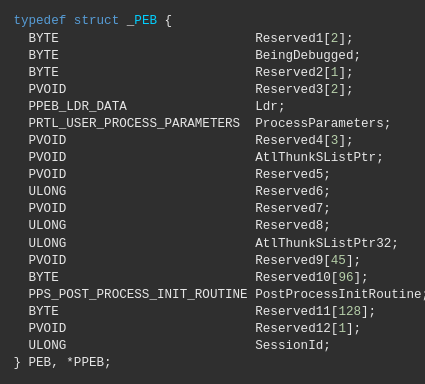
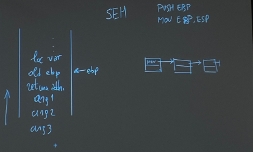
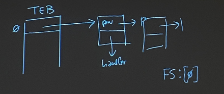

# Appunti di Malware Analysis

# 3 ottobre 2023

## Sistemi operativi consigliati

Poichè la maggior parte dei malware da analizzare sono sviluppati per Windows, ci serve un sistema Windows per testarli. Questo sistema deve però girare su macchina virtuale, non sul computer host, in quanto una gestione non attenta del malware potrebbe portarlo ad operare sul
nostro pc di riferimento. Per evitare ciò, sarebbe buona norma avere un sistema operativo diverso da Windows sul nostro pc host.

## Virtualizzazione

Per creare macchine virtuali, oltre ai soliti VmWare e VirtualBox, il professore suggerisce Qemu, in quanto è un servizio di paravirtualizzazione efficiente, mentre i primi due sono solo emulazioni software. Qemu ha un  apprendimento più ripido, ma propone una efficienza migliore.
Non è obbligatorio usare Qemu, in quanto la caratteristica principale che vogliamo sono gli snapshot, ovvero la possibilità di generare delle istantanee del sistema. Ad esempio, possiamo fare uno snapshot prima e dopo l'inserimento del malware, e vedere cosa è cambiato.

## Ottenere il codice macchina: processo


## Flag da GCC

Prendiamo il seguente file che stampa "Hello World":  


Se compiliamo con `gcc -E test.c|less` otteniamo la sua precompilazione, questa è solo una parte, il codice includerebbe anche prototipi, struct, etc...  


Se compiliamo con `gcc -S test.c -o test.s`otteniamo il suo assembler:  


Infine, con `gcc -c test.c -o test.o` otteniamo le istruzioni macchina  


Possiamo usare `objdump -d test.o`per avere più ordine:  


## Librerie

### Librerie statiche

Se nel file oggetto esiste un riferimento a printf, il linker mette nel programma eseguibile tutte le istruzioni macchina da printf. Vengono incorporate direttamente nell'eseguibile del programma durante la compilazione. Sostituisco le call prinft con l'indirizzo della procedura. Il codice è nel file eseguibile, libreria non serve più. Opero a compile time.

### Librerie dinamiche

Il loro codice non viene incorporato nell'eseguibile, ma avviene un
collegamento dinamico a runtime. Il linking avviene col sistema operativo, che mantiene queste librerie dinamiche `.dll` o `.so`. Le dimensioni del file sono minori, in quanto nel programma non ho copiato nulla, ma solo collegato.

#### Esempio

Se rimovessi `stdio.h`, ma il mio programma usa le print, ho un errore già a livello assembly. Questo perchè il precompilatore mette il riferimento, per poi delegare il resto al linker.

## Osservazioni sui file eseguibili

Il file eseguibile NON è un file oggetto. Il file eseguibile contiene tutto il necessario per eseguire.
Posso avere anche più file oggetto. Dal file oggetto costruisco un file eseguibile su disco che diventa poi un processo in RAM. Un processo è una istanza di programma in esecuzione, un insieme di informazioni che consentono al programma di tracciare la sua esecuzione.  


I file oggetto (in blu) sono composti da sezioni. 
Il linker lega tutte le sezioni di uno stesso tipo (es: `.text`) in un unico **segmento** (es: `.text`), appartenente al *file eseguibile (in rosso)*. 
**Sezioni $\neq$ Segmenti**
(Possiamo trovare *più sezioni* rispetto al numero di *segmenti*.) 
Passando al **processo**, questo aggiunge elementi non appartenenti al file eseguibile (come le librerie dinamiche.) Posso decompilare un file eseguibile, ma non un file oggetto. Questo perchè un file eseguibile contiene già il codice macchina tradotto in binari eseguibili, ovvero è più vicino all'hardware. Il file oggetto, invece, non è ancora completo, poichè dovrà essere combinato con
altri file, essendo solo una parte. Inoltre, è possibile incorrere in ottimizzazioni.

# 5 ottobre 2023

## Tipi di disassemblatori

Il disassemblatore è un tool che legge codice macchina (espresso in byte) e associa, per ogni sequenza di byte, un'istruzione macchina simbolica.

- **Lineari**: Dati dei valori numerici $v_1,...,v_n$, cioè un flusso di byte, va ad associare ad ogni byte una istruzione macchina (nb: una istruzione macchina potrebbe richiedere più di un byte). Non è detto che tutte le istruzioni abbiano la stessa lunghezza (questo è vero in architetture RISC come ARM, dove 32 bit corrispondono a 4 byte per ogni istruzione, mentre in altre architetture, come CISC, non è vero.) Il disassemblatore lineare è però abbastanza *dummy*, non comprende il codice. Nel caso dei salti, non si preoccupa di dove saltare. Ad esempio:
  $v_1,v_2 |\;v_3, \;v_4|$ se $v_1,v_2$ identificano un salto verso $v_4$ (l'istruzione macchina parte da $v_4$), ma il disassemblatore associa $2 \; byte = 1 \;istruzione$, allora "salterà" verso $v_3$.
  Un esempio di disassemblatore lineare è `objdump -d`.

- **Interattivi**: Segue la semantica delle istruzioni. Se c'è *jump*, si riallinea a dove arriva il salto e continua con l'analisi del codice macchina. Il set di istruzioni *escluse*,comprese tra *jump* e *dove arriva* viene lasciato all'utente.
  Questo perchè c'è un'*interazione* tra utente e disassemblatore, quindi se ottengo nuove conoscenze,  le riverso nel disassemblatore e ottengo nuove informazioni. Se ad esempio riconosco una struttura dati, e la individuo, posso dire al disassemblatore di risolvere i riferimenti a questa struttura dati, in modo da non vedere più indirizzi generici, ma richiami a questa struttura. Un esempio di disassemblatore interattivo è **Ghidra**.
  GIà nel fornire un file da analizzare a Ghidra, questi ci fornirà informazioni sul file (formato, architettura, compilatore etc....) che possiamo "dare per buono" o non seguire. Ci chiederà inoltre cosa usare per l'analisi, alcune "tecniche" sono assodate ed affidabili, altre, in rosso, sono sperimentali.
  Generalmente quelle proposte vanno bene per i nostri scopi.

## 32 vs 64 bit

Classifichiamo in *x_86* a *32 bit* e *x_86_64 / AMD64* a *64 bit*. 
La maggior differenza risiede nella dimensione dei registri (*4 byte* contro *8 byte*), ed alcune differenze tra registri o istruzioni.

## Intel vs AT&T

Nell'architettura *Intel* ho prima la destinazione (dove scrivo), poi la sorgente (dove leggo).
Per *AT&T* è il contrario, abbiamo prima la sorgente (dove leggo), e dopo la destinazione (dove scrivo).
Esempio:
`mov reg,8` quanti byte uso per rappresentare 8? dipende dal registro, se esso è a 32 o 64.
`mov ptr,8`, quanto è grande l'indirizzo?

- In Intel l'istruzione è `mov DWORD ptr,8`

- In AT&T l'istruzione è `movl 8,ptr` dove con *l* intendiamo *long*, 4 byte.
  Abbiamo anche 1 byte (*b*), 2 byte (*w*), e 8 byte (*q*).

- Con il suffisso `-M` vedo sempre i suffissi.

### Esadecimale, base 16

Si preferisce tale base perchè ha un mapping coi bit. 
Tra poco vedremo come.
$257_{10}=16^2+1=(101)_{16} = 16^2+16^0$, è facile da convertirlo in binario, poichè basta scrivere ciascuno degli elementi sfruttando 4 bit  :
$0001 |0000|0001$. Questa scrittura viene compattata con l'uso di numeri da 0 a 9 e lettere da *a* (1001) ad *f* (1111).  
Ad esempio: $1010|1011|0011|0111|1111 = a|b|3|7|f$

## Big Endian vs Little Endian

Prendiamo $259_{10}=256+3={103}_{16} = |0001|0000|0011|$
Se raggruppiamo a blocchi di 8 bit avremmo: $...0001|00000011 = 1|3$
(Quindi, se lavoro con 8 bit/2 byte, il numero più grande è *f f*, e posso rappresentare da 256 byte diversi, $2^8$, da 0 a 255.) Con 8 bit dimezziamo lo spazio per memorizzare informazioni!
Come rappresento $1|3$ in **memoria**?

- Con **Big Endian** il byte più significativo va a sinistra, quindi in memoria scrivo $1|3$.

- Con **Little Endian**, il byte più significativo va a destra, quindi in memoria scrivo $3|1$.

In realtà, qui abbiamo supposto un *ordinamento totale*, in realtà potrebbe anche essere *parziale*, dato $v_1,v_2,v_3,v_4$ possiamo avere:

- Little Endian Intel totale: $v_4,...,v_1$

- Little Endian parziale: $v_2,v_1|v_4,v_3$

- Big Endian: $v_1,...,v_4$

## Registri

Rappresentano memoria immediata che usa il processore.

In **X_86** abbiamo:

- *segmenti*: *CS* (dove sta il codice), *DS-ES-FS-GS* (data), *SS* (stack)

- *general purpose*: 
  *eax* (accumulo) e sottoinsiemi *ax/ah/al*
  *ebx* e sottoinsiemi *bx/bh/bl*
  *ecx; 
  edx; 
  esi/si; 
  edi/di; 
  ebp/bp*

- *special purpose*:
  eflags (bit stato nel processore, interruzioni)/flags
  eip (instruction pointer)
  cr0, cr1...

- *floating point*:
  mmx0,...,mmx7 di tipo vettoriale usabili anche in virgola mobile, chiamandoli fpr0,...,frp7
  xmm0,xmm15 anch'essi vettoriali.

La limitazione principale è che 32 registri sono pochi, quindi spesso si lavora con lo stack.

In **X_86_64** principalmente estendiamo la maggior parte dei registri:

- *general purpose*:
  *rax/eax/ax/ah/al*;
  *rbx;*
  *rcx*;
  *rsi*, ..., *rdi*, ..., *rbp*

- Aggiunta di nuovi registri *r8,...,r15*

- *special purpose*: *rflags*, *rip*.

Si lavora in pagine o segmenti. Non vedo i registri dei segmenti nel codice macchina, spesso sono *impliciti*. Ad esempio: `mov reg, dword ptr p`, in questo caso è implicito che, trattandosi di dati, uso il segmento *DS*.
Se uso `call f`, con *f* funzione, allora uso *CS*, poichè si tratta di testo.
Con `mov reg FS:[]` sto specificando di usare *FS*, altrimenti è sottointeso *DS*.


**NB**: L'Endianess si vede in memoria, **NON** nei registri! Quindi qui non mi preoccupo di dove collocare le cose.

# 10 ottobre 2023

## Primi passi con Ghidra

Analisi di un file a 32 bit Windows. Il formato è di tipo Portable Executable (PE), usato per file eseguibili, file oggetto, librerie condivise e device drivers,
Questo formato presenta delle *testate*.  
La prima testata è **IMAGE_DOS**, ma al giorno d'oggi è inutile, è un retaggio del passato.  
Successivamente troviamo **IMAGE_NT_WIN_32:**, questa testata è espandibile con Ghidra per vederne il contenuto (c'è il tasto + sulla sinistra).   
E' possibile vedere informazioni come *sezioni*, *timestamp* e **Optional Header**, che in realtà, NON è opzionale come si potrebbe pensare, anzi è fondamentale oggi!  
Osservazione: Se leggo un file dal SO, viene aggiornato il metadato associato all'ultima apertura. Questa informazione non è del file, ma del sistema operativo. L'eseguibile analizzato ha tutte le info necessarie per creare il processo, come la zona del codice, dei dati etc... che non sono metadati.
**AddressEntryPoint**: 4 byte, non ha indirizzi bensì **RVA**, cioè offset in riferimento a dove il sistema operativo va a caricare il codice, che è la *base of code*.

Sappiamo che i file eseguibili sono rilocabili, posso caricarli in posizioni diverse da dove sono stati idealmente pensati, e questo richiede di modificare anche indirizzi associati, come se stessimo traslando.
Le *posizioni relative* restano immutate, se una istruzione dista 5 linee da un'altra, non mi importa dove viene posto il blocco, sempre 5 linee le separano.
Ricordiamo che disassemblatore $\neq$ debugger, poichè noi non stiamo eseguendo nulla, vedo solo dove il compilatore ha predisposto le componenti.

## Analisi dei tipi di indirizzi

- **RVA**: è un offset rispetto ad un indirizzo di base in cui viene caricata una certa sezione.

- L'**offset** è uno spazzamento rispetto al file. Questi aspetti li troviamo nel file eseguibile.

- Quando eseguiamo `call func1` usiamo componenti $<c_i,v>$ dove $v$ è una parte dell'indirizzo logico.

Noi abbiamo tre tipi di indirizzi:   


Noi ci troviamo nel primo cerchio, il secondo cerchio è un *indirizzo virtuale/lineare*. Nel primo cerchio l'indirizzo non è completo.
L'indirizzo logico è composto da *(segmento, offset rispetto al segmento)*, noi vediamo solo l'offset $v$, quindi dobbiamo associargli il segmento. Quale? CS.
Questo indirizzo logico *non è* quello del processo.

### Cosa è un indirizzo lineare (o virtuale, a livello hardware)?

E' un numero a 32 bit (se il file è a 32 bit), è una cella di memoria che diventa fisica se passa per la *paginazione*.
FIle eseguibili possono avere stessi address ed entry point, ma a seconda del processo (o dei flussi dell'eseguibile), posso avere indirizzi lineari uguali a cui associo, tramite paginazione, posizioni diverse per ogni processo.
Se i segmenti partono da 0, allora   
$0+\;offset = offset = indirizzo \; lineare$
Nei modelli flat (in cui si parte appunto da 0) ho dei segmenti lineari e non logici, in quanto dispongo del dato completo.
Come lo capisco? se vedo segmenti *CS,DS,SS*, in quanto nel modello piatto sono caricati a 0.

## Aspetti dello stack

Nel file analizzato, c'è l'operazione `sub esp, 0x1c` che può essere "tradotta" da Ghidra come `sub esp,28` mediante il tasto "convert".
Lo stack intel dispone di un registro *esp* a 32 bit/4 byte nella versione *x_86* e a 64 bit/8 byte in *x_86_64*. Qui parliamo di memoria lineare, non fisica.
Il registro *esp* tiene l'ultimo indirizzo più in alto, cioè l'ultimo scritto.
Più lo stack cresce verso l'alto, più gli indirizzi che uso sono piccoli. 

```markdown
| ....  |
| code  |
| data  |
| heap  |
| stack |
```

Tra *heap* e *stack* non c'è una divisione netta. Questo perchè:

- L'heap cresce dall'alto verso il basso, più gli indirizzi crescono scendendo.

- Lo stack cresce dal basso verso l'alto, e mentre cresce gli indirizzi diventano più piccoli. 

Così entrambi crescono fino alla collisione, senza avere necessità di definire un confine.

-----

**Esempio mio**: 
E' come un quaderno per due materie, che usiamo sulle due facciate. La prima materia è come l'heap, parto da indirizzo piccolo (pagina 0) e cresce di pagine. L'altra materia è come stack, parto da indirizzo grande (pagina 100, fine quaderno), e andando indietro "decresco", così la materia che prende più spazio ha la meglio, e non devo però definire una linea di divisione.

Ritorniamo a `sub esp,28`: poichè operiamo a 32 bit, ovvero 4 byte, allora $\frac{28}{4}=7$, cioè stiamo *allocando 7 posizioni sullo stack*.
Questo è un altro indizio che ci suggerisce che il file sia per Windows a 32 bit:
Se fosse stato a 64 bit, non potevamo ottenere un numero intero facendo $\frac{28}{8}$, quindi non potevo prendere "bene" lo stack.

-----

Esaminiamo anche `dword ptr [esp] => local_1c, 0x1`:
*=>* è realizzato da Ghidra, non è assebler!  
Stiamo scrivendo $1$ su una cella di memoria, di 4 byte perchè è una *dword*.
Poichè lavoriamo in Little Endian, abbiamo $|00|00|00|01$ (infatti, come abbiamo visto nelle vecchie lezioni, possiamo comprimere i 4 byte in 2 byte, che vanno da 00 ad *ff* !)
**NB:** Possiamo assegnare, tramite Ghidra, dei nomi o *etichette* per rendere l'analisi più leggibile, oltre a dei commenti.

#### Altro sullo Stack

Se chiamiamo una funzione, dobbiamo salvare l'indirizzo di ritorno, usando proprio lo stack. Le operazioni sono:

- PUSH: push from instruction pointer, realizzato quando chiamo le call.

- POP: pop to instruction pointer, realizzato quando eseguo una return.

Presa una funzione:

```
int f(int a1, int a2, int a3)
{
 int v;
 int v2;
 int v3;
}
```

**v** è una variabile automatica persistente/visibile *solo* nella funzione, grazie allo stack. Tuttavia abbiamo detto che lo stack cresce e decresce, il compiler come fa a risalire alla posizione di **v**?
Sicuramente devo usare un *riferimento* rispetto **esp**, ma abbiamo detto che **esp** mantiene la cima dello stack, che appunto si muove.

- Dovrei mantenere spaziamenti aggiornati per trovare ogni volta ciò che mi serve, ma sarebbe complesso.

- Posso dedicare un registro base **ebp** come riferimento fisso, l'aspetto negativo è che sto sprecando un registro! Tuttavia questo è il metodo più diffuso.

Nello stack, basandoci sul codice di riferimento sopra, verranno aggiunti nello stack *prima i parametri* (partendo dall'ultimo verso il primo), poi il *return address* e poi *le variabili automatiche*, sempre in ordine inverso perchè lo stack è descending. Avremmo:

```
|    v     |
|   v2     |
|   v3     |
| ret addr |
|   a1     |
|   a2     |
|   a3     | 
```

In realtà, sopra *ret addr* andrebbe allocato spazio per il registro *ebp*, fisso.
Quindi, partendo dal basso e salendo, avremo ad un certo punto uno spazio per *ebp* che coinciderà proprio con *esp*, e sopra di lui le variabili $v_i$.
In questo modo, sappiamo dove sono collocate rispetto *ebp*.

```
|    v     | <- ebp -12
|   v2     | <- ebp -8
|   v3     | <- ebp -4
|   ebp    | <- esp = ebp
| ret addr | <- ebp +4
|   a1     | <- ebp +8
|   a2     | <- ebp +12 
|   a3     | <- ebp +16
```

A livello assembly, ciò che facciamo viene spesso racchiuso dal nome **enter**:

```
push ebp        <- metto ebp nello stack
mov esp, ebp    <- posiziono stack su ebp
sub esp, 12     <- alloco 3 posizioni per le variabili
```

Tuttavia difficilmente troveremo **enter** o **leave** nei nostri malware:

```
mov esp, ebp    <- riporta stack su ebp
pop ebp         <- togliamo ebp, quindi andiamo su ret addr
ret             <- ritorniamo all'address specificato
```

Vedremo poi, se una funzione fa return:

- Se possiede un registro, quel registro di ritorno è *eax*

- Se *non* possiede un registro, fa return di una struttura.

# 2 novembre 2023

|               | Basic Static Analysis | Advanced Static Analysis | Basic Dynamic Analysis | Advanced Dynamic Analysis |
| ------------- |:---------------------:|:------------------------:|:----------------------:|:-------------------------:|
| **White box** | $V$                   | **$V$**                  |                        |                           |
| **Grey box**  |                       |                          |                        | $V$ (più potente)         |
| **Black box** |                       |                          | $V$                    |                           |

## Analisi statica

Quando parliamo di **Analisi statica**, abbiamo due categorie:

- **Advanced**: uso del disassembler interattivo, come Ghidra, in grado di analizzare il codice mediante interazione con utente.

- **Basic**: Si limita a guardare cosa contiene  il file per rapportarsi al mondo circostante. Usa dei tool per capire cosa c'è dentro il programma, senza scendere al livello dell'assembler. Posso vedere API, system call, .dll usate, ma non istruzioni macchina. A volte basta questo. Cosa ci posso fare?
  
  - **hash**: firme digitali, usata in ambito forense, per dimostrare che un certo file o documento non è stato alterato.  
    Possiamo calcolare con `sha256sum w03.exe` 
  
  - Esistono siti che raccolgono *malware già noti*, quindi non ho bisogno di rifare il lavoro da 0. Tuttavia compaiono numerosi malware ogni giorno, quindi è difficile avere un database aggiornato. Gli *anti-virus*, per superare questo limite, identificano dei pattern particolari   
    (*euristiche*) per l'identificazione. Il sito **Virustotal** contiene euristiche conosciute e ci dice se, un certo file, fornito da input, le contiene. 
    Fornire un file a tale sito però, comporta aggiungere la firma del file nel sito, e quindi, chi ha creato il malware, può vedere se è stato analizzato su questo sito.
  
  - **stringhe**: cercare le stringe dentro un eseguibile, mediante comando `strings`, oppure `strings -n 2 nomefile` se cerco stringhe di due caratteri. Il malware può offuscare le stringhe!
  
  - **PE header**: dentro troviamo numerose informazioni, come le API. Ci sono vari software, in Windows `cffexplorer`, a cui passo un eseguibile con *drag&drop* e ne decodifica la testata. Oppure c'è `PEview`, `peBear`, `peTools`, `dependency worker` (prende un eseguibile e ricostruisce API che individua, con tutti i collegamenti, anche ricorsive. Non più supportato.). Infine `resourceHacker`, in cui possiamo vedere risorse incluse, come icone, manifest, ... tutte sostituibili!

## Analisi dinamica

Parlando di **analisi dinamica**, si ha:

- **Basic**: esegue monitoraggio, come WireShark. Viene visto anche ciò che viene scritto o letto dalla nostra applicazione. `peID` è un tools per analisi statica, ma usa plugin che potrebbero eseguire il codice, quindi non è proprio di analisi statica.

- **Advanced**: eseguita con Debugger, strumento più efficiente. Monitor che associa ciò che fa il programma con codice ad alto livello. Lenta e costosa, ma potente, il malware lo teme e cerca di proteggersi.

# 7 novembre 2023

La differenza rispetto all'avanzata risiede nello sforzo per portare a termine l'analisi. La *statica* (qualsiasi tipo) è meno esosa (ma rende anche meno) rispetto ad una *dinamica*.
Per l'analisi dinamica di base si richiede di eseguire il malware in un ambinete idoneo, ad esempio sistema operativo Windows. Non sulla macchina host, bensì un ambiente controllato, come un macchina virtuale guest.

## Process Explorer

Normalmente tutti questi tool si eseguono come amministratore, perchè operano a basso livello. Parte facendo vedere tutti i processi del sistema, è dinamico, vediamo *chi* lancia *cosa*, quanto occupa. Quando lancio qualcosa, lo vedo qui insieme al *PID*. Molti malware cercano di nascondere i propri processi facendo finta di essere un processo del sistema. Esistono tanti processi di sistema, sono sicuro che ci siano, allora impersona lui.
`services.exe` lancia i daemon, e si appoggia a `svc-host.exe`, che ospita il servizio. Tipicamente si impersonifica quest'ultimo. *Process Explorer* ci dice, con *tasto destro* $\rightarrow$  *properties* $\rightarrow$ *image file* $\rightarrow$ *verify*, con il quale controlla la firma digitale rispetto al processo originale. Se è di Microsoft, allora è verificato. Abbiamo anche una scorciatoia per *VirusTotal*, ma se non siamo connessi dà errore di sicurezza. Altra cosa che fa è, da   
*properties* $\rightarrow$ *strings* $\rightarrow$ *image*, guarda l'eseguibile e ritorna le stringhe,   
posso farlo sia sul programma sia sul processo in esecuzione (essendo *tool dinamico*). Normalmente le stringhe non differiscono di molto. Non coindicono quando l'eseguibile in memoria è diverso dall'eseguibile su file, ad esempio il malware lancia un eseguibile ufficiale (che è verificato), ma poi svuota tale eseguibile, e sostituendolo in memoria con il malware.

Sappiamo che un file eseguibile è composto da *testo, data, bss, risorse*.   
Per risparmiare sulle dimensioni dell'eseguibile, si usano i *packer*, che prendono queste info e le trasformano in un nuovo eseguibile, con una parte *testo* piccolissima, e il resto è tutto compresso, decomprimendolo poi in memoria. Poi fa jump a prima cella del codice originale. Quando viene caricato in memoria, ricrea la forma originale. Se confronto con la versione compressa, ovviamente avrei un offuscamento, dobbiamo confrontare la versione non compressa nel disco (anche la versione compressa è nel disco) e memoria.


## Process Monitor

Eseguo anche lui come amministratore, ciò che fa è monitorare il sistema durante l'esecuzione, prende tutti i processi nel sistema. Possiamo applicare dei filtri (a forma di imbuto). Possiamo selezionare quali operazioni guardare.
Interessanti sono i *registri di sistema*, con cui Windows raggruppa le informazioni di configurazione. Noi vediamo le *chiavi di registro*. Sono delle informazioni da preservare, e i *registri* ne contengono molte. Esiste tool di sistema **regit** che ci permette di modificare le chiavi (sono le *HKEY_LOCAL_MACHINE_xx*). Per vedere queste chiavi, c'è di meglio.

## Regshot

Esegue due fotografie, una a sistema pulito senza malware, e quindi *shoot* delle chiavi di registro. Quando ho finito, lancio il malware. Poi verrà eseguito il *compare* tra le chiavi, per vedere cosa è cambiato. Qualcosa cambia sempre, non è difficile capire ciò che tocca il malware rispetto ad altri processi. E' un tool lentino, perchè fa il check di molte chiavi. Quando si ha finito, otterremo un file (**da usare nel report**) con ciò che è cambiato.

## Wireshark

Usato per flussi a livello di rete.

## ApateDNS

Per il malware è meglio mettere nomi simboli piuttosto che indirizzi IP, con un server DNS che mappa il nome simbolico su indirizzo attivo. Quando seguo il malware, ogni qual volta che farà tale richiesta passerà per il DNS.
Voglio poter decidere se, quando un malware fa richiesta DNS, io possa rispondere con un mio indirizzo, non voglio bloccare l'analisi. Spesso questo tool non si usa da solo, ad esempio **Inetsim** (linux), il quale lancia una serie di server configurabili per rispondere alle richieste come voglio io. (ad esempio: se viene richiesto Google, ritorna address google. Se viene chiesto indirizzo *strano*, dagli il mio indirizzo!)

## ApiMonitor

Ha più informazioni sulle API, ci aiuta ad interpretare ciò che fa l'applicazione. Si può usare come alternativa di ProcessMonitor. Entrambi condividono il limite di monitorare le applicazioni. Un deviceDriver usa API a basso livello, quindi solo ApiMonitor riuscirebbe a vedere qualcosa.

## Esempio di analisi w03-03 [parte 1]

Mai farlo sulla mia macchina primaria. In ogni caso dovrò fare snapshot.
Lo snapshot in Qemu può essere:

- esterno: file che è derivato da quello principale, se lo tocco, tocco il derivato, non l'originale. Se tocco l'originale, quello derivato si corrompe.
  In Qemu c'è `qemu-img create -b <NomeSnapshot> <NomeOrig>`, quindi il file si appoggia ad un altro.

- interno: nel file registro i punti di recupero, come `qemu snapshot -c`

Normalmente si fanno due snapshot, dal primo si disabilitano alcune impostazioni di sicurezza, e poi si fa il secondo snapshot.
Se andiamo in *sicurezza di Windows*, dove abbiamo le varie protezioni di virus, minacce, protezione account. Dobbiamo togliere *"controllo delle app per il browser"* (togliere *protezione del flusso di controllo CFG* e *protezione esecuzione DEP*, anche la randomizzazione può essere utile da rimuovere.)
Dobbiamo togliere anche *protezione in tempo reale* (presente in *Impostazioni di Protezione da virus e minacce*). Anche *invio automatico dei file di esempio* etc sono cose tranquillamente rimovibili.

### Come passo il malware su VM?

Il prof usa *shared_memory*, ma questa non è una buona pratica. Posso usare una pennetta usb. Anche le *guest additions* possono far capire al malware di trovarsi in una VM.

### Inizio analisi

Avviamo *process monitor* e *process explorer* a 64bit, tanto c'è compatibilità. Lanciamo il malware. Compare un `vc-host.exe`, ho finestra errore che mi dice "impossibile avviare correttamente...". Abbiamo creato quindi questo processo, allora il malware vorrebbe fare la sostituzione. Se vedo le *properties* mi dice che è *verificato*, perchè si vede il file eseguibile da dove è partito. Allora questo malware ha livelli di accesso kernel. Se c'è questa sostituzione, ho anche stringhe diverse, infatti non ci sono! Perchè abbiamo cose diverse, e perchè il malware si richiude subito.
Il malware non sta funzionando, perchè è un malware vecchiotto, lavora a basso livello, e c'è incompatibilità con Windows 10. Ne serve una più vecchia, ad esempio Windows XP. Dovrei partire sempre da Windows vecchi? No, avrei tools vecchi.

#### 

# 9 novembre 2023

## Esempio di analisi w03-03 [parte 2]

Proviamo Windows XP su VirtualBox. Quasi nulla la resistenza al malware. Si fa sempre snapshot prima di scaricare il malware. Per procedere, eseguiamo lo stesso iter già visto con Win10: *Process Explorer* (lanciato come amministratore) e *Process Monitor* (sempre come amministratore). 

Lanciamo *explorer.exe*, abbiamo processo `vc-host.exe` visibile su *Process Explorer*. Cosa vogliamo da questo malware? Vorremmo capire cosa fa, a che cosa serve, senza fare un'analisi dettagliata del suo contenuto. Il malware è identificato da un numero, $724$, creato da *lab03-03*. Nel *filter*, possiamo dire che siamo interessati agli eventi generati da $724$, escludendo gli altri. Possiamo vedere se tale processo è conosciuto da *VirusTotal*, se non ho internet calcolo lo sha e lo metto sul sito. Alternativa: vedo le *properties*. Qui risulta *verificato*, perchè `lab03-03` ha creato il processo `vc-host.exe` che è ufficiale, lo ha svuotato e ci ha messo ciò che voleva lui. Se apriamo un `vc-host.exe` ufficiale, vediamo le stringhe tra *immagine* e *memoria*, esse sono assolutamente uguali. Sulla versione `vc-host.exe` con malware, c'è invece differenza.


Troviamo alcune stringhe "curiose": *shift*, *backspace*,... si tratta di un **Keylogger**. Ovvero salva le operazioni eseguite dall'utente. Però non basta, dobbiamo dimostrare questa tesi. Se prende ciò che l'utente scrive, allora lo salva da qualche parte. Qui entra in gioco *process Monitor*, che registra le API usate dal processo.


Possiamo vedere se queste informazioni vengono mandate tramite *internet*, ma non vengono scritte lì. Dobbiamo prima includere il nuovo filtro con `add` e poi fare `apply`.
Alternative: *file su disco*, *registri del sistema* (che sono sempre file di sistema, ma organizzati dal sistema operativo).
Ci sono degli eventi, ma se vediamo le chiavi, notiamo che molte non le apre oppure sono associate al terminale. Diciamo che sono operazioni *comuni* a tutte le applicazioni.
Vediamo sui *file su disco*, vediamo un accesso continuo ad un unico file di log sul desktop. Infatti, sul desktop è comparso un nuovo *file.log* con tutto ciò che è stato scritto.

## Analisi ed intro al Debugger

- **White-box**: Composta da analisi *statica di base*, *avanzata*.

- **Black box**: *dinamica di base*.

- **Grey box**: eseguo programma in maniera controllata, si usano i *debugger*.

Tipicamente i debugger lavorano a livello del codice sorgente.
Classifichiamo i debugger in due famiglie: **Source level** e **Assembly level**.

Altra differenziazione è su *come operano*: **User Mode** vs **Kernel Mode**.

Ovviamente il secondo è molto più potente, perchè può debuggare anche cose di tipo kernel. Poichè il malware è scritto per l'utente, spesso basta *user mode*. I *rootkit* (processi che non vediamo mai nei programmi visti, perchè lavora a livello di sistema operativo, nascondendosi), lavorano in *kernel mode*, quindi serve debugger di tipo kernel.

Alcuni debugger lavorano in modalità *locale*, altri in *remota*, o ancora *mista*.
Il locale gira sulla stessa macchina del processo esaminato, nella modalità remota c'è disaccoppiamento. Esempio in questo secondo caso, malware *Android*, il debugger lo metto su un computer, è sicuramente più comodo.

Ultima distinzione: malware con *GUI* (interfaccia grafica) ed altri basati su *CLI*, cioè linea comando.  I debugger hanno comunque "più potenza" a livello CLI, e poi sopra si costruisce la GUI. Questa potenza in più è data dal fatto che con GUI è difficile riportare tutte le complicazioni graficamente.

Il primo debugger che vediamo è quello incluso in Ghidra.
In realtà è un *meta-debugger*, cioè capace di integrare nel proprio flusso di lavoro i risultati di un debugger separato. Quando importiamo un programma, clicchiamo sul *bacarozzo* vicino al *drago*. Se non c'è, lo abilitiamo nel campo *tools*. Ciò che ci si pone davanti è la *finestra del disassembler*, e tutto il resto è *debugger*. In *debug target* (in alto a sinistra), specifico quale debug usare. I debugger proposti sono: 

- *gdb* (tre versioni: locale, via ssh, via gadp)

- *ldb* (debugger per MACOS, anche qui meccanismi locali e remoto)

- *windbg* (debug di Windows, sia 32 sia 64 bit, sia user sia kernel, sia local che remoto... insomma tutte le versioni)

- *windbg Preview* o *windbg 2* (versione successiva)

Tuttavia lavorare con queste implementazioni in Ghidra non è semplice, si registra una *traccia dell'esecuzione* su cui scorrere avanti ed indietro.

Anche **IDA Pro** è valutabile, perchè include un proprio debugger, oltre a funzionare con *meta-debugger*. Sia *user* sia *kernel*, sia locale sia remoto, sia 32 sia 64 bit.

Un altro debugger è **SoftIce** puramente *kernel mode*, è tipo un *hypervisor* tra *kernel* e *sistema operativo*. Potentissimo quanto vecchio. Oggi inutile.

Oggi si preferisce usare **OllyDbg versione 1.10**, anche lui vecchio, ma comunque con molti plugin (esempio: auto identificazione di strutture dati note). E' solo *usermode 32 bit Intel*, di tipo *GUI*.
Da lui deriva *OllyDbg 2*, interfaccia uguale, ma riscritto internamente. Lento, pochi plugin. Il creatore poteva evitarselo.
C'è anche *OllyDbg 64*, però meh pure lui.
Abbiamo anche *ImmuneDbg*, c'è versione di base oltre a quella a pagamento.
Stessa interfaccia, è riprogrammabile in Python, cioè posso scrivere script in Python per automatizzare l'analisi.
Altro figlio è  *X64dbg*, sia a 32 sia a 64 bit. Interfaccia diversa? Ovviamente no.
E' buono per i 64 bit.

L'idea è che, a seconda di ciò che abbiamo avanti, dobbiamo ponderare la scelta del debugger migliore.

## Overview su OllyDBG

- *In alto a sx*: disassemblato, parte da entry point, sintassi intel (destinazione a destra).

- *In alto a dx*: finestra registri, il loro contenuto, tutti! (follow in dump per seguire uno specifico registro). Interessante è *debug flag T*, bit che, quando viene generata eccezione, viene impostato ad 1 prima di eseguire, genera trap per  il sistema operativo , che invece di segnalarla al processo (che sarebbe il naturale corso degli eventi) la segnala al debugger. Con il comando *step into F7*, decidiamo noi come proseguire in questi casi.

- *In basso a sx*: finestra sui dati, vedo quello a cui punta un registro, vedendo la sua evoluzione.

- *In basso a dx*: finestra sullo stack, che cresce per indirizzi decrescenti, su indirizzi superiori ci sono vecchie posizioni dello stack.


OllyDbg interpreta anche i valori. In alto a sx c'è il tasto *play* per eseguire l'eseguibile sotto al debugger, posso sospenderlo ovviamente.
Ad esempio, con *W03* possiamo bloccarci nell'esatto momento in cui si sta creando la finestra. Possiamo fare anche *step into - F7*, ovvero istruzione per volta, aggiornando i registri (interessante è il flag *T* visto sopra).
Se facciamo una call, con *step into*, vedo istruzione per istruzione, con *step over* tale call viene vista come un unico blocco di codice, passando alla call successiva ad esempia. Il malware potrebbe "capire" che stiamo usando *step into* e bloccarlo, allora usiamo *step over* con *breakpoint*, per aggirare il problema. Nell'immagine in memoria, il debugger, prima di lanciare istruzione, sostituisce un byte con singolo byte, in particolare usa *int3*, che genera istruzione di *trap*. Poi il debugger rimette in *int3* l'istruzione originale, se decidiamo di eseguirla. Possiamo fare patch (tipo NOP 90), ma le starei mettendo in memoria, modificando il processo in memoria, non l'eseguibile, quindi modifico il comportamento "in quel momento".

# 14 novembre 2023

Continuiamo con *OllyDebug*, prendiamo *W03*. Concetto essenziale è quello dei *breakpoint*. Permette al debugger di intervenire, quando ritiene opportuno. Sono i meccanismi principali usati dal malware per capire se sta venendo analizzato. Classifichiamo:

- Breakpoint attivati in esecuzione: i più comuni.

- Breakpoint attivati quando accedo ad una locazione in memoria.

- Breakpoint software, tramite sistema operativo. 

- Breakpoint hardware.

I **breakpoint Execution/Software**, basati su istruzione `INT3`, o `0xcc`. Un programma è composto da tante istruzioni macchina. Ad un certo punto divido per 0, quindi questa istruzione macchina, a livello hardware, genera un'interruzione per trasferire il controllo ad una routine dentro il sistema operativo. Il sistema può quindi gestirla in diversi modi, dal terminare il processo all'associazione di un gestore (presente nel codice stesso, fatto da noi). Riguarda processo/programma, sistema operativo, hardware.

Adesso, quando si verifica tale evento, il sistema operativo ferma l'esecuzione demanda la gestione/controllo al debugger. Il debugger può fare quello che preferisce. Vengono quindi aggiunte `debug exception INT3`. Questa gestione è detta *first chance*. La gestione *last chance* è quando invece abbiamo interruzioni come divisione per 0. Una tecnica di difesa del malware consiste nella ricerca in memoria del byte `0xcc`. Quando lo trova, e "capisce di non avercelo messo lui", termina, oppure cambia l'esecuzione originale.

Nei breakpoint **Access/Software**, il programma tenta ad accedere a delle pagine, che tramite debugger e sistema operativo, sono state poste ad esempio in sola lettura. Quindi si verifica un page fault. Ciò genera eccezione, la quale viene gestita, e successivamente vengono riassegnati i diritti originali su quella pagina.

Queste operazioni non hanno nulla a che fare con **Execution Step by step F7**, che sfrutta una *trap flag*, in cui dopo ogni istruzione macchina interviene il debugger, e l'esecuzione si ferma. Il malware può sempre vedere l'impostazione di questo trap flag, e poi vede se lo ha messo lui o meno.

I breakpoint **hardware** prevedono che il processore abbia registri contenenti un indirizzo, una dimensione, ed una modalità di accesso.
Quando arriviamo ad un certo indirizzo, e sto provando a scrivere un byte ad un indirizzo (dimensione), genera una eccezione. In Hardware, verrà generata una eccezione hardware. Sono utili perchè il malware si difende maggiormente dai breakpoint software rispetto a quelli hardware. Non funzionano nello stesso modo. Di contro, il numero di registri hardware di debug è limitato. Non è detto che il malware non li controlli!

## Visione codice Ollydebug

Si parte da entry point, possiamo procedere con *step into*(F7, singola linea) e *step over* (F8, singola funzione/blocco di codice). Con *step over* usiamo in modo congiunto i breakpoint. Quando supera l'istruzione, rimuove il breakpoint. Con F2 mettiamo un breakpoint "stabile" di esecuzione.
Con tasto destro $\rightarrow$ *breakpoint* $\rightarrow$ possiamo mettere un breakpoint hardware. Inoltre è possibile vedere la lista di hardware breakpoint.
Abbiamo anche breakpoint **condizionali**, ad esempio in un ciclo, possiamo essere interessati solo ad una determinata condizione. Quindi le iterazioni non di nostro interesse sono sempre presenti, ma non ci vengono fornite; solo quella da noi specifica ci restituirà il controllo.
Per i *breakpoint in memoria* dobbiamo accedere al sottomenu *dati* (nell'interfaccia, in basso) mentre i *breakpoint in esecuzione* li metto nella zona superiore dell'interfaccia.
E' possibile vedere anche:

- L: log di tutto quello che è stato fatto, fin dall'apertura.

- E: tutti i moduli eseguibili, dimensione entry point,...

- M: memory map, come divisione in segmenti

- T: programmi Windows composti da più thread, qui li vediamo, li blocchiamo etc..! Quando debug ferma processo, li ferma tutti, a meno di non specificare un certo thread da bloccare.

- W: Tutte le finestre, come TextEdit, buttons,..., tutti gli elementi della finestra.

- H: tutti gli handel, possiamo vedere i token aperti dal programma.

- I: è possibile modificare l'eseguibile, in tale finestra vediamo le patch applicate.

- K: insieme di funzioni invocate come risultano sullo stack.

- B: breakpoint, posso assegnare label agli indirizzi, anche se spesso si preferisce riportarle sul disassembler.

- S: mano a mano che eseguo il codice, mi fa vedere sorgente e dove mi trovo. Non lo useremo, in quanto non si ha il sorgente.

Da *debug* possiamo "animare il codice", quindi vengono eseguite le istruzioni, vedendo il risultato. Poco utile.
Più utile sono le *tracce*, utili per registrare un'esecuzione, per poi rivederle con calma. Quindi usiamo una tecnica basata su *temporizzazione*.

Se siamo dentro una funzione, possiamo fare *esegui fino a return, F9*, quindi trova il return della funzione, mette il breakpoint, e si ferma. Se siamo dentro *.dll*, possiamo fare *return fino a user code*, quindi ritorna appena esce.

NB: **F4 significa *esegui fino al cursore***

## Come trovare winMain

L'esecuzione con F8, se non ritorna, ma il mio programma non ritorna, allora il *winMain* è interno alla funzione. Allora uso F4 fino ad una certa funzione, e poi F7 per entrarci dentro. Voglio trovare invocazione con F8, perchè passo sopra alla call, anche quelle sconosciute. Finchè il programma non si ferma, non è winMain. Quando vedo che il *programma parte* (quindi vedo la finestra), ho trovato qualcosa di interessante. Me lo salvo con F2, e vado avanti con F8, per cercare ciclo messaggi. Procedo così finchè non trovo un ciclo, lo vedo perchè ripercorre ricorsivamente delle istruzioni. Mi metto col puntatore sulla jump, e faccio F4, per saltare direttamente senza aspettare.
Poichè andando avanti riparte il programma, uso F2 per salvarlo. Entro nelle funzioni con F7, se eseguo con F8, procedo, ad un certo punto trovo il ciclo dei messaggi (possiamo anche *animarlo*).

## Lab 09-01 [parte 1]

Vogliamo capire come è fatto tale malware. Debugger è analisi avanzata, partiamo quindi con analisi di base statica.  Ottimale è *PE-Studio*, nell'esempio usiamo *PE-Explorer*. Vediamo info di base, come *entry point*, data creazione, etc. Troviamo le sezioni che compongono il programma, come *read only* e *data*. Con *PE-bear* (si legge meglio), vediamo che il programma non è offuscato, perchè le dimensioni delle sezioni coincidono (vedo *virtual size* e *raw*). Se differenza importante, allora offuscato.
Niente info utili, passiamo ad *analisi dinamica di base*. Facciamo snapshot, e poi apriamo *Process Explorer*. Apriamo *Process Monitor*. E richiudiamo.

Andiamo con *Ghidra*. Proviamo a cercare le stringe. Potrebbero essere interessanti *NOTHING, HTTP, DOWNLOAD, UPLOAD, SLEEP, CMD,  un sito Http*, che ci suggeriscono delle attività fatte su un server esterno. C'è una stringa che suggerisce la stampa di qualcosa. C'è una chiave di Registro *XPS*.
Per avere persistenza, il malware usa chiavi di registro. Non può usarla direttamente, perchè viene sovrascritta tra comandi leciti. Può usarla in modo fittizio. Ad esempio,  *SOFTWARE MICROSOFT XPS* invece di *SOFTWARE  MICROSOFT  XPS*.
E' presente anche `$SYSTEMROOT\$`, variabile d'ambiente dove vive l'installazione del sistema operativo. In particolare, si fa riferimento a `\system32\`, che insieme a *cmd.exe* potrebbe sembrare un accesso a shell comandi. I comandi sono di tipo *dos*, tra cui c'è " /c del", per cancellare un file. Se facessimo da prompt "cmd.exe /c date" mi ritorna la data da una sottoshell. Con "/c del" cancelliamo un file. Tutto questo perchè le stringhe non sono offuscate.

 Ora possiamo tornare ad analisi dinamica di base, con *Process Explorer* e *Process Monitor*. Dovremmo anche lanciare *Regshot*, per fare confronto tra snapshot pre-malware e post-malware.

Eseguiamo il malware, che si è aperto e poi si è cancellato. E' ancora in esecuzione? Vedendo su Process Explorer, no. Probabilmente si è cancellato perchè qualche cosa non gli è piaciuto.

Sappiamo il nome del processo, contiene "lab-09". Quindi da *Process Monitor* filtriamo e vediamo cosa ha fatto. Quali sono gli eventi legati all'esecuzione?
Sappiamo, dall'analisi statica, che si interagisce con la chiave di sistema. Applichiamo i filtro per vedere solo chiavi di registro, cercando "microsoft " (con lo spazio). E' presente, la apre ma non la trova (NAME NOT FOUND), quindi non l'ha creata. Vediamo inoltre che la chiave è sotto la cartella "WOW6432" perchè malware 32 bit, sistema a 64 bit, e c'è meccanismo di alias. Non viene ulteriormente usata. Sappiamo che si è cancellato, con shell di comandi. Vediamo di fare una ricerca sui processi, come quelli che governano i file.exe
Troviamo un *process create*. Con tasto destro e *property* vediamo linea comandi: confermiamo che il malware cancella se stesso.
Quindi al malware non piaceva l'ambiente, e si è cancellato.
Non possiamo andare avanti, serve il debugger.
Prossimo step: *analisi dinamica avanzata*.

# 16 Novembre 2023

## Lab 09-01 [parte 2]

Se vediamo, in Ghidra, l'entry-point del decompilato, sappiamo che, verso la fine, dovremmo trovare la funzione main. Come lo individuo? Prende due parametri, ovvero `argc` e `argv`, trattandosi di un programma da "terminale", senza GUI.
Trovato il main, a riga `00402af0`, facciamo partire **OllyDgb** e saltiamo a tale istruzione, mediante `CTRL+G`. Mettiamo breakpoint con F2, e facciamo partire l'esecuzione, passo passo. Quando trovo una call, ci passo sopra, non entro dentro (questo lo farebbe il debugger), fino a che non trovo qualche cosa di particolare, come *processo terminato*. Il debugger ha tenuto aperto il sistema operativo, quindi non si è autodistrutto. Possiamo fare restart e ricominciare l'esecuzione, run fino all'entry point e poi f8. Stavolta mi fermo alla call che ha portato alla chiusura, a riga `402410`. Vediamo su Ghidra cosa fa questa funzione, invoca `GetModuleFileName`, che ritorna il percorso dalla root in poi, del modulo specificato. Quindi il percorso di Lab 09-01.

Poi abbiamo `getShortPathName`, ovvero il nome del file finale. Successivamente `ShellExecute`, comando mediante shell dei comandi. Il comando è `cmd_exe`, che sta trai parametri. Vediamo anche le altre stringe `\c del`, `>> null` (per ridirezionare l'outuput in un "pozzo oscuro"), quindi sta ricreando la stringa per cancellare il file. Alla fine invoca una serie di funzioni che ci portano alla fine a `FUN___00402e3c`, che richiama `ExitProcess`, la quale uccide il processo. Quindi la funzione da cui parte tutto, dopo riga`40240e`, è quella che effetta il suicidio. E' buona norma mettere etichette anche nel debugger.
In **OllyDbg**, a partire dal main (`00402af0`), vediamo un salto a `00402801` che ci evita di passare per il suicidio. Torniamo su Ghidra per capire come entrarci. In Ghidra rinominiamo la funzione main, cioè `int main(int argc, char ** argv`). Vediamo che viene confrontato `argc` con $1$, ovvero se `argc=1` vuol dire che non abbiamo argomenti, in quanto il primo "argomento" sarebbe il nome del file, quindi almeno un argomento ci sarà.
A riga `00401023` c'è un altro confronto, ci interessa perchè è un altro confronto per entrare nel suicidio. In questa funzione, in Ghidra, vediamo un riferimento a `0040c03e`, ovvero la chiave *farlocca*.
Dinamicamente, con F8 su OllyDbg, eseguendo troviamo `EAX=0`, quindi faremo suicidio.
**Il programma si uccide perchè numero di argomenti è zero, e non trova una chiave che si aspetta di trovare.**

Lo abbiamo scoperto mediante analisi debug, analisi statica e dinamica.
Se ne rispettassi solo una, funzionerebbe?
Potrei mettere la chiave, ma probabilmente avrei altri check sul contenuto.
Proviamo a mettere un argomento.
Altra strategia sarebbe modificare i test, modificando i valori. Ad esempio, a riga `00402B08`, il salto viene preso perchè flag `Z=1` (lo vediamo nel campo Registers, a destra del programma.) Possiamo fare fare, nel campo registri, dove si trova Z, premere tasto destro e fare `reset`. Potrei anche modificare `EAX` e metterci il valore `1` invece che `0`. Posso modificare registri di stato come preferisco.
Tornando alla tecnica originale, vado su `debug -> arguments` e passo argomento per eseguire. Passiamo un valore a caso, perchè non so cosa voglia. Riusciamo a superare il primo jump. Ad altezza media dell'interfaccia, vediamo che lo stack ci informa delle operazioni svolte.
Andando avanti, cadiamo comunque nel suicidio, quindi non basta mettere un argomento, ma vuole qualcosa di specifico. A `00402510` avviene ciò, su Ghidra, vedendo il decompilato, sicuramente più comprensibile dell'assembly. Se vediamo da dove siamo partiti, da riga `00402b1d`, mettiamo su `EAX` ed `ECX` *argc* ed *argv*, in `EDX` l'indirizzo della stringa che corrisponde all'ultimo argomento. Se ci fosse stato LEA, avrei trovato (risata malvagia).
*argv* punta a vettore di stringhe, quindi ogni elemento è a sua volta un puntatore ad una stringa. In `EAX` abbiamo messo 2 (perchè abbiamo passato un argomento), in `ECX` viene messo l'indirizzo del vettore, cioè argv. Poi in `EDX` faccio degli spiazzamenti, in particolare `ECX+4`, cioè un indirizzo.
In `EDX` quindi puntiamo all'indirizzo della stringa, con `LEA` avremmo puntato all'indirizzo contenente il puntatore della stringa.


Nel decompilato di `FUN_00402510`, rinominata `check_password`, vediamo che vengono eseguiti continui check, che impostano `uVar2` a 0 se qualcosa non gli piace. Però, senza perdere tempo, vediamo che alla fine a noi va bene se `uVar2 = 1`, inoltre capiamo, dai check che fa, che la password che vuole è `abcd`.

La cosa migliore da fare è *una patch*, possiamo farlo con **OllyDbg**.
Devo assemblare delle nuove istruzioni, se premiamo "spazio" su una istruzione, possiamo metterne una nuova. Mettiamo `XOR EAX, EAX`, il quale lo azzera. Ricordiamo che vogliamo avere `1` su EAX.

Nella seconda istruzione `402512`, mettiamo `INC EAX`, per ottenere 1. 
La funzione è `___cdecl`, quindi gli argomenti vengono tolti dal chiamante.
Nella riga successiva `402513`, mettiamo `RETN` (lo fa lui in automatico).
**Tali modifiche sono sull'eseguibile in memoria, non sul disco.**

Per **salvarlo**, tasto destro sulla parte di codice, `copy to executable`, e poi `all-modification`, voglio copiare l'intero eseguibile. Infine `copy all`. Si apre una seconda finestra, con il codice. Questa va salvata, tasto destro, `save file`, e quindi la salviamo chiamandolo in modo riconoscibile.
Chiudiamo il file originale, e mettiamo il file patchato. **Non mantiene i breakpoint**. Devo rimetterli tutti, per questo è buona norma salvare le cose anche esternamente, come Ghidra.

Facciamo ripartire il programma, mettiamo breakpoint sul main, passiamo argomento `AMW2023`.  Finalmente abbiamo superato il suicidio. Ora?
Magari, con analisi dinamica di base, posso ottenere altre informazioni.
Riapriamo **Process Explorer, Process Monitor64, Regshot**.
In quest'ultimo prendiamo la fotografia pre-lancio, poi lanciamo il programma, e prendiamo fotografia successiva.

**NB: meglio lanciare una copia dell'eseguibile patchato.**
Si è richiuso e cancellato nuovamente! 
**Non abbiamo patchato il controllo del parametro.**
Da Shell, lanciamo il programma patchato con il parametro di prima (non lo abbiamo patchato).
Il programma si è richiuso, vediamo se qualche tool ha preso qualche dato utile. Con **Process Monitor** filtriamo gli eventi per `file system`. Spesso quelli in fondo sono quelli di nostro interesse. Niente di che.

Proviamo con **Regshot**, ci dice 21 valori modificati. Tuttavia sembrano modifiche del sistema operativo, la *registry key* non sembra essere stata toccata.
Qui spesso si va di esperienza: molti malware richiedono *diritti di amministratore*. Noi lo abbiamo lanciato come *user*, magari questo malware funziona bene con *admin*. Potrei capirlo se, vedendo i *log*, trovassi qualche failure dato dai mancati diritti. Proviamo con *admin*.

**NB: Sicurezza di Windows -> Impostazioni di protezione da virus e minacce -> Disattiva protezione in tempo reale**. Non è persistente.
Lanciamo come *root* `cmd.exe`, poi ci spiazziamo nella cartella contenente il malware. Prima rifacciamo gli snapshot, perchè stiamo provando un nuovo avvio con settings diversi.
Da `cmd.exe` lo lanceremo normalmente (abbiamo già eseguito come amministratore `cmd.exe`). E' stato nuovamente rimosso. Facciamo il secondo shot. Nuovamente, nessuna conseguenza. Cosa sbagliamo?
Magari, lui guarda il numero di argomenti, se sono 0 chiudi, se 1, metti una password. Ma magari si aspetta altri argomenti. Sennò perchè specificare di prendere l'*ultimo argomento*?

Torniamo al *disassembler*, nel *main*.  Vediamo che il suicidio viene fatto 7 volte, noi ne abbiamo trovati solo 2. Quindi probabilmente siamo entrati in uno degli altri 5.  Possiamo vedere che `argv` viene chiamato svariate volte localmente. Ad esempio in `00402b3f` accediamo al primo argomento. Poi viene fatto push ad un indirizzo, che è un dato `DAT_0040C170`, che è `-in`, vediamo sopra che ce ne sono altri. Allora `data` -> `terminateString` per creare tali stringhe (Ghidra non le riconosce perchè troppo brevi).
Scendendo vediamo che Ghidra riconosce `strcmp`, cioè wrapper che richiama `strcmp`.  Allora la funzione che richiama tale funzione la rinominiamo proprio così.
Se le stringhe diverse, faccio confronti vari, e poi fa suicidio. Il nostro parametro (AMW2023) non va bene in questi check.
In OllyDbg non viene riconosciuto *strcmp*, è molto più complicato usare solo lui! Ghidra, disassembler interattivo, mi da un aiuto enorme. Lo capisce perchè è codice, Ghidra è configurato in maniera tale da avere vari motori di analisi, tra cui `functionID`, che riconosce funzioni degli eseguibili confrontando con funzioni di libreria avente una certa firma. Non è una cosa banale, tipicamente può capitare che il `codice.o` venga rilocato, oppure che richieda altri riferimenti. Quindi non c'è una corrispondenza 1-1, ma cerca parti del codice *non modificabili*, e cerca solo loro. Ovviamente, se alcune cose non sono del database di Ghidra, non le trova. In `file->file configure->core->FidPlugin`, attivo di default. Allora ho `tools->functionId`, che mi dice le librerie che conosce. Altre cose, non riconoscerebbe le hash. Posso aumentare queste conoscenze. Se installo `mingw` di Windows, posso ricostruire database anche per quello.

# 21 Novembre 2023

## Lab 09-01 [parte 3]

Abbiamo visto che il malware si suicida. Ciò è dovuto dalla mancanza di alcune condizioni, infatti abbiamo visto che il malware si aspetta di essere lanciato con degli argomenti specifici. L'ultimo argomento è una password.
Se corretta (noi l'abbiamo patchata), procediamo, e vediamo il primo argomento `argv[1]`:

- se è pari a `- in` (mediante `strcmp`, se 0 sono uguali), vede se il numero degli argomenti è $3$ (nomefile, "*-in*", password). Vediamo che accetta anche un quarto parametro opzionale, tra "*-in*" e *password*.

- se è pari a `-re`, sempre $4$ argomenti.

- se è pari a `-c`, può avere $7$ argomenti (quindi 4 argomenti, togliendo la stringa, il nome del file, e la password.)

- se + pari a `-cc`,  accetta solo la password.


A riga `00402e7e`, vediamo la chiamata di una stringa, ma *senza parametri*, nonostante il formato sembra richiederli. Non sono *fprint*, *sprintf* perchè richiedono precedentemente un puntatore a funzione o simili. Quindi è una `printf`. Tuttavia Ghidra non la interpreta bene, perchè non può non avere alcun parametro. La funzione è `__cdecl`, chi la chiama rimette a posto gli argomenti, perchè avendo parametri variabili, chi la chiama vede quanti ne ha chiamati. Vediamo inoltre il push di $20$ byte, corrispondente a $5$ parametri.

Rinominiamo la funzione della stampa, per indicare parametri variabili basta definirla con un argomento contenente `...`

Iniziamo a vedere i casi, prima di tutto dobbiamo disattivare la *protezione in tempo reale*, lanciando poi *Process Monitor* (analisi dinamica di base) e *Process Exporer*. Facciamo anche lo screenshot con *RegShot*.
Lanciamo l'eseguibile da *shell* di comandi.

### Casi da analizzare

Nb: `pw` patchata, può essere qualsiasi cosa.

- `lab09_01 -in pw`, dopo averlo lanciato, fermo acquisizione di *Process Monitor*. L'eseguibile non si è cancellato. Non vengono creati nuovi processi dal nostro malware in *Process Explorer* (utile usare il filtro per nome, con nome del file). Facciamo `compare` tra le chiavi in Process Explorer. Ha aggiungo 117 chiavi, e modificate 88.
  Sono però chiavi di sistema, e manca la chiave vista all'inizio, che includeva `XPS`. Non abbiamo eseguito in modalità amministratore,
  La colonna `REPARSE` vuol dire che non sono riuscito a leggere la chiave.
  Dobbiamo rifare fotografie, monitoraggi, etc...
  Si richiude nuovamente. Ragioniamo: se fossi un malware, sarei interessato all'auto-attivazione nel sistema. Se riavvio il computer, il malware vorrebbe essere già pronto. Vedendo la differenza sulle chiavi, ci sono $15$ chiavi aggiunte, tra cui quella `XPS` che stavamo cercando. Le altre chiavi aggiunte sono associate al nostro malware. Vengono inseriti dei `servizi`, equivalenti ai demoni di sistema in Linux.
  Viene espresso un percorso in cui è stato aggiunto il malware, diverso dalla posizione iniziale. Recandoci nella cartella, non lo troviamo. Questo perchè malware è $32$ bit, sistema a $64$ bit. Viene *mappato* in un'altra posizione, per trovarla bastare usare lo strumento di ricerca. Il nuovo path (generato automaticamente) è sito in `C\Windows\System\WOW64`.
  *Tasto destro* sul file, apri *percorso file*, è perfettamente identico all'originale, si è copiato!
  Sempre in `Process Monitor`, vediamo il **control set** è un insieme di configurazioni del sistema operativo, come è configurato attualmente, possono essercene diversi. Serve per tornare in vecchi control set, in caso di errore. Il malware tocca il control server corrente. Il malware sta cercando di diventare un *servizio*, dandogli un nome, di tipo Locale (non esclude che non possa esporsi sulla rete, ma generalmente possiamo vederlo come "*opera su questa macchina*").
  Possiamo vedere i servizi del sistema mediante`services.mcs`, dove cerchiamo "Lab09-01", senza descrizione, ma con *stato empty*, cioè non è stato avviato, e c'è anche il *tipo di avvio* (automatico = 2, impostato in una delle $15$ chiavi toccate, manuale, disabilitato).  
  Finalmente abbiamo capito: questo tipo di avvio *infetta il sistema*, eseguendo l'**installazione**.
  Se aggiungessi il parametro opzionale, cosa toccherebbe? Probabilmente il nome del servizio, il nome del file, o il path di installazione.

- `lab09_01 -re pw`, rimuove il malware probabilmente. Facciamo sempre fotografia chiavi di sistema, usando *Regshot* prima del lancio e dopo il lancio. Troviamo $7$ chiavi cancellate, che però non c'entrano nulla col nostro applicativo. Ha cancellato anche il *Services*, che non è più presente tra i servizi attivi. Ha tolto le chiavi di configurazione, non quella **XPS**. Lascia delle tracce. Bisogna differenziare il concetto di *chiave* e il concetto di *valore della chiave*.

- `lab09_01 -cc pw`, chiama una funzione che richiama *printf* senza argomenti. Ritorna una configurazione, con *sito* e *porta  80*. Esegue il **dump** della configurazione.

- `lab09_01 -c <a1> <a2> <a3> <a4> pw` probabilmente *setta* la configurazione. Proviamo a settare qualcosa e ad eseguire. 
  Successivamente avviamo con flag `cc`, e vediamo che sono cambiati!
  Esegue **configurazione**.

- `lab09_01` è come parte il servizio, senza argomenti. E' il caso *normale*. Quindi non so *cosa faccia* il malware, perchè fino ad ora si trattava di configurazione.

Se in `services.mcs` troviamo in `XPS` la nostra configurazione, con stringa `30 31 00 ...` cioè le nostre stringhe, salvate nel registro di sistema.

### Analisi Ghidra - debugger parte 2

#### Casi analizzati precedentemente

Partendo dal file *patchato* (per superare la password), la func `004025b0` ottiene il nome dell'eseguibile, cioè " *lab09-01.exe*", poi invoca altra funzione interna, alla quale ho passato indirizzo su stack e dimensione pari a $1024$, quindi è un buffer. La funzione è lunga, quindi vediamo sul *debugger*.
Per capire meglio cosa fa una funzione, conviene guardare i parametri *prima* e *dopo*, tendenzialmente ci si sofferma su una operazione specifica. Infatti la funzione in esame è rinominabile come `getServiceName`, richiamata in `-in` ma anche nel flag `-re`, perchè devo sapere cosa eliminare. 

Nel caso `-c` si esegue, passando `argv` coi rispettivi offset (riga sotto a `00402c79`), ed invocando `handler_c` (chiamato così da noi!).

Nel caso `-cc` è come abbiamo già visto, con la stampa di questi parametri.
Manca il caso generale.

#### Caso principale con nuove info

Nel caso *base*, viene chiamata `RegOpenKeyExA`, se esiste ritorna $1$ e chiama un *handler*, se fallisce $0$, e quest'ultimo caso porta al suicidio. Ovvero, si uccide se non è installato.
Lui si accontenta della chiave, del servizio non c'è alcuna precisazione, quindi il malware funzionerebbe comunque. Vediamo la gestione dell'handler, al riferimento `402360`, nel caso corretto.
Torniamo al *debugger*, mettiamo breakpoint su `402360`, cioè handler del servizio. Fallisce perchè l'ultima operazione è stata di tipo `-re`, quindi dobbiamo reinstallarlo. Adesso entra.
Cosa ci aspettiamo?
Sicuramente un *loop*, perchè se c'è un collegamento a qualcosa di remoto, c'è un processamento continuo.

# 23 novembre 2023

## Lab 09-01 [parte 4]

Dobbiamo cercare un *loop* senza fine, perchè in attesa di richieste.
In `service_main` troviamo `handler_cc`, che otteneva dalla chiave il registro.
Se avviamo il programma, senza parametri, ci aspettiamo un ciclo senza fine; tuttavia il programma pare si chiuda. Ma è effettivamente attivo? Se andiamo nella finestra dei servizi attivi, esso è registrato, ma non attivo. Se lo attiviamo da lì, abbiamo `errore 1053` troviamo un messaggio di errore che ci conferma il non corretto funzionamento. Per capirlo, dobbiamo tornare al debugger (*OllyDbg*) e capire dove si chiuda. Lo lanciamo *senza argomenti*, mettiamo un *breakpoint* su *main*. Attualmente abbiamo riferimento `00402360` per il service_main e `402AF0` per il main vero e proprio.
Ciò ci porta alla funzione `00402eb0`. Il suo ingresso lo prende *stranamente* da `EAX`, non standard, quindi è simile ad una libreria. E' come se il compilatore fosse stato *costretto* a fare così.
Mi serve studiarla? No, perchè non è lei il problema, ci sono passato attraverso.
Successivamente, viene messo *forzatamente* $1$ in `EAX`, indipendente dalla return della funzione precedente. Poi fa un `test` (viene fatto un AND bit a bit tra EAX e sè stesso, quindi salto se EAX è 0, quindi non salto mai alla funzione successiva) e `jmp`.
Ciò ci suggerisce un ciclo.
Un altro test ci porta a 402180, che è `handler_cc`, che possiamo ulteriormente analizzare. Essa chiama tre funzioni:

- `402e6a`, a cui passo la stringa `80/0` (buffer locale con stringa `80`, ultimo carattere è fine stringa), e viene eseguita una `atoi`.

- `401e60`, passo`http://www...` e il valore precedentemente convertito. (in basso a destra, in *OllyDbg*, vediamo i parametri passati). Essa invoca `401E60` con due argomenti, `19d2ec` e `400 hex`  (1024 decimale). Su `EAX` ritorna $1$ (lo vediamo in alto a destra di OllyDbg). Sotto c'è un controllo.
  Se tale controllo fallisce (variabile $\neq 0$) ritorna, sennò continua.
  Quindi è questo che ci sta bloccando. Soffermiamoci su questa.

Comunque, da `401e60`, vediamo svariate chiamate a funzioni, in cui si prende l'*hostname*, la *porta* e la stringa *qk6p...*. Se riavvio e la invoco, cambia!
Ciò che produce è un `randonName`. Non è questa che dà problemi.
Arriviamo a `00401AF0`, in cui passo $4$ argomenti, ma non in tutti ci ho scritto dentro, quindi possono essere di output. Il ritorno è $1$, è lei che fallisce.
Vediamo cosa fa, mettiamo un breakpoint e ripartiamo, entrandoci dentro con `F7`:
All'indirizzo `40165e` vediamo una call che Ghidra non riesce a risolvere. Per Ghidra, viene invocata `WS2_32.DLL::Ordinal_115`, ma non sa quale sia il nome simbolico. Sul *Web*, siamo fortunati che al primo link di Github ci sia un ragazzetto che le ha numerate tutte! Se il ragazzetto non c'è, ce lo dice *OllyDbg*, è un `wSAStartup`,  cher cercando sul sito Windows capiamo aprire una WinSocket per una connessione di rete. Ha successo? con `F8`, ritorna $0$, funziona. Andando avanti, abbiamo `Ordinal_52`, cioè`getHostByName`, e funziona anche lei, perchè torna $0$. Stiamo per eseguire `Ordinal_116`, cioè la chiusura della connessione. Allora è **fallita** `getHostByName`. Questo perchè ritorna un *puntatore alla struttura*, e solo se fallisce ritorna un puntatorenullo.
Con *OllyDbg* e tasto `-` possiamo tornare al precedente valore dei registri. Non possiamo cambiare strada, ma vedere il passato. A `getHostByName` abbiamo passato la stringa `http://www.practicalmalwareanalysis.com`, ma esiste questo sito?  Si. Capiamo meglio cosa fa questa funzione, usando il manuale Linux, in quanto quello Windows è in stato *To be Done*, cioè incompleto. Capiamo da `man gethostbyname` che ciò che dobbiamo passare è una *url*.
Riconfiguriamo il malware:
`lab09-01.exe -c ups www.practicalmalwareanalysis.com 80 60 AMW23`

Ora il puntatore è diverso da null. Riavviamo il servizio, e non funziona ancora. Continuiamo nell'analisi:  
`ntohs`: conversione dei numeri, perchè in un pc possiamo avere  LittleEndian o BigEndian.
La connect funziona e si connette, stiamo più o meno intorno al riferimento`401835`. Andando avanti, troviamo a `4018e6` una `send`. Cosa mando?

- `GET` file random che abbiamo espresso prima, con getRandomName.

- `HTTP /1.0`

Si ottiene una `receive`, ci sono dei byte scambiati.
Al riferimento `401F10`, vediamo che vengono passati *accenti gravi* ed *accenti acuti*. Viene poi invocata `403060`, che ritorna $0$. Poi altre cose e ci ritroviamo in `EAX` $1$.

Il fallimento si ha perchè la risposta che ottiene non è quella effettivamente fornita dla server. Non è il server giusto. Ma quale è? Boh.
Creiamo noi il server! Deve stare in ascolto sulla porta $80$ e ritornare la stringa richiesta.
La VM manda messaggi a `wlan0:0:`, in cui viene specificato un indirizzo IP.
Lo vediamo dall'host Linux. Potremmo mettere anche quello dell'interfaccia di rete.
Cambiamo allora:
`lab09-01.exe -c ups 192.168.74.2 80 60 AMW23` (l'indirizzo è quello del prof). Se pinghiamo tale indirizzo, funziona.
Per il messaggio di risposta, usiamo `NetCat`, coltellino svizzero di *TCP/IP*.
Meglio metterlo su Linux (per Windows è un malware), con:  
`sudo nc -l -v -p 80`, in cui siamo in ascolto su tutte le porte.
Rieseguiamo:  
Abbiamo una connessione da indirizzo `192.168.74.100` e porta `60421`.
Proseguiamo con `F8`, vengono fatte operazioni sulle stringhe, poi a arriviamo alla `send`, e vediamo sul terminale la richiesta del file.
Ora, procedendo, rimane in attesa della risposta. Rispondiamo scrivendo sul terminale la sequenza di caratteri di accenti e prendendo invio.

A riferimento `401f1c` c'è il controllo su quello che si riceve, mettiamoci un breakpoint. In realtà, Windows vuole come terminatore di stringa`CTRL-M``CTRL-J``CTRL-M`, cioè `\r\n`. (sul Terminale dovremmo vedere `^M^J^M`).
Fatto sta che il programma è diffidente, e infatti da *Ghidra* vediamo che ci sono più stringhe controllate diverse volte. 
`FUN_403060` è complicata, ma in realtà è `strstr`, cerca nella stringa una sottostringa.  
(serie di frasi in cui ci viene detto che ci vuole pazienza...)

Dalla funzione `402020`, vediamo comandi di `sleep`, `upload`, `download`etc...
Come capiamo che si tratta di loro?  Se vediamo i vari `DAT`, notiamo che sono delle stringhe brevi che non sempre Ghidra riconosce. Sono operazioni dal server verso il malware, ovvero possiamo fare anche operazioni di `cmd`, da remoto possiamo fare qualsiasi cosa. Tutto ciò unicamente instaurando un canale. Se non inviamo, dal server, uno dei comandi espressi, la connessione si chiude!

# 28 novembre 2023

## Comportamenti del malware vs debugger

Non possiamo analizzare tutti i meccanismi, in quanto essi sono numerosi e sempre rinnovati. Possiamo però lavorare con quelli più *consolidati*.
Classifichiamo i comportamenti anti-debugging:

- **Detection**  
  Il malware si rende conto di essere sotto debug, altera il suo comportamento. Può semplicemente non funzionare, o depistare l'analisi. E' diretto.

- **Identificazione del comportamento del debugger**  
  Il malware non si rende pienamente conto di essere sotto debugger, ma nota dei pattern tipici. E' indiretto.

- **Interference**  
  Il malware genera interferenze per le funzionalità di debug.

- **Exploit dei bug del debugger**  
  E' una derivazione particolare del caso precedente, in particolare sfruttando alcuni bug del debugger stesso. Molto pericoloso.

## Detection

### ant1.exe

Avviamo il programma `ant1.exe`, prima *senza* debugger, poi *con* debugger.

Nel primo caso, il programma mostra una finestra, con un comento.
Nel secondo caso, il programma termina subito. Ciò richiede di usare un *disassembler*, che non è detto sia immune ad alterazione del comportamento.

Abbiamo visto che il programma, se lanciato a mano, mostra delle stringhe, quindi potremmo cercare quelle. Tali stringhe si trovano al riferimento `00402650`, in cui troviamo l'API `isDebuggerPresent`. E' una semplice funzione Windows. Quindi una buona prassi, è quella di vedere se tale funzione è presente ancor prima di avviare il programma, magari patchandola per non essere ostacolati. Tale invocazione è  a `402666`, e quindi su **OllyDbg** mettiamo un *breakpoint* dopo esserci messi su tale riferimento (`ctrl+G`). Poi possiamo semplicemente forzare il bit booleano del check.

### ant2.exe

Stesso simile comportamento. Apriamo con Ghidra, cerchiamo Windows $\rightarrow$ Symbols. Non c'è `isDebuggerPresent`, bensì `CheckRemoteDebuggerPresent`.
Non vuol dire che il debbuger sia remoto! 
La differenza è che questa nuova funzione controlla solo il processo che esegue l'API, la prima può ricevere l'handle di altri processi.

Ugualmente, andiamo su **OllyDbg**, puntiamo a riga `402676`, mettiamo breakpoint, eseguiamo con F9 , fissiamo `EAX = 0` (prima è a $1$) e possiamo procedere.

### ant3.exe

Fino ad ora siamo stati faciliati dal fatto che ci fossero delle chiamate a funzioni palesi. Apriamo con Ghidra, cerchiamo i simboli. Le due funzioni di prima *non* sono presenti. Un'altra possibilità è data da `NtQueryInformationProcess`, API di basso livello.   
Le `.dll`  di Windows presentano tre livelli:

- Le `.dll` di alto livello interagiscono direttamente con l'applicazione. Ne è un esempio `USER32.dll`. Queste utilizzano `.dll` di *medio livello*.

- Le `.dll` di medio livello presentano nomenclatura del tipo `Nt...`.

- Le `.dll` di basso livello presentano nomenclatura del tipo `Zw...`.

`NtQueryInformationProcess` non è ben documentata, perchè non usata direttamente dal programmatore. Tra le varie informazioni che gestisce, c'è `ProcessDebugPort`, che ritorna $1$ se stiamo usando un debugger.
Tale funzione non è però presente. Quindi o viene usata in modo diverso, o viene usato altro. Infatti, la troviamo tra le stringhe, non tra le funzioni.
I simboli che trova il debugger sono trovati al momento della compilazione, allora tale API è invocata con un altro sistema. Ciò ha senso perchè, come abbiamo detto, raramente viene invocata direttamente.
Il riferimento che troviamo è `Ntdll.dll`,  con `loadLibraryA` la carichiamo a **runtime**, in essa sarà presente `NtQueryInformationProcess`; con `getProcAddress` prendiamo l'indirizzo di partenza di tale funzione.
Possiamo bypassarla in vari modi: patch del flag, uso di `NOP`,... .

### ant4.exe

Funziona solo su *Windows7*.
Qui si ha `OutputDebugString()`, la quale permette di inviare una stringa al debugger, invece di usare una `printf`. Se il programma non è debuggato, *prima* resistuiva un errore in modo *subdolo*, cioè mediante `getLastError`, ovvero il codice dell'ultimo errore; oggi `NULL`.  Nel programma, basato su vecchia implementazione, prima si imposta un errore generico con `setLastError`, poi `OutputDebugString()`, e poi `getLastError`:

- Se l'errore è diverso, c'è il debugger di mezzo.

- Se l'errore è lo stesso, non c'è il debugger.

## Come funziona un processo in Windows

Tutte le informazioni del processo, ovvero istanza del processo in esecuzione, sono contenute in un'area kernel.

In Windows, queste informazioni non sono tutte nel kernel, una percentuale rilevante di queste strutture dati è presente nella zona user.

La struttura dati **Process Environment Block** è usata dal S.O. per memorizzare informazioni rilevanti per il processo. Ogni processo ha la propria **PEB**.  Tale struttura  presenta molti campi *reserverd* (leggasi: Windows non ci dice cosa sono, anche se molti sono stati compresi).



Notiamo subito `BeingDebugged`, che ci dice se siamo debuggati o meno.

### Come arriviamo alla PEB?

Windows, come Linux, è piatto, non usa i segmenti. Gli indirizzi che vediamo, sono offset di segmenti che partono a $0$, quindi **gli offset sono indirizzi lineari**. Ogni thread attivo di un processo ha una struttura dati, accessibile all' offset $0$ utilizzando il registro segmento `FS`. La segmentazione è comunque sempre attiva, e `FS` presenta le informazioni specifiche di quel thread.

All'offset `0x30` si ha un pointer alla `PEB`. 
La *struttura* PEB è *unica* per il processo, ma ogni processo può avere moltissimi thread.

Quindi dobbiamo puntare a `FS:[30h]` e poi spiazzarci al secondo campo `BeingDebugged`.

In linguaggi orientati agli oggetti, c'è un modo per organizzare i blocchi `try & catch`, e tale meccanismo, che cattura le eccezioni *asincrone* rispetto l'esecuzione principale, sfrutta `PEB`, quindi può essere usato anche per cose legittime.

### ant5.exe

Troviamo `MOV EAX, FS:[0x30]` e poi `MOV EAX, dword ptr [EAX + 0x2]`, che è proprio ciò che abbiamo appena descrito, senza uno delle API.

### Controllo dell'Heap

Tra i vari campi di `PEB`, all'offset esadecimale `0x18`, abbiamo riferimento alla struttura `ProcessHeap`, cioè come gestisco la parte di memoria per l'allocazione dinamica. Prendo da qui le pagine. 

Il processo, se debuggato, ha una gestione dell'heap diversa rispetto al caso non debuggato. In particolare, vengono coinvolti i flag `ForceFlags` e `Flags`, con valore $0$ in assenza di debugger, o $\neq 0$ se c'è debugger.
Il problema è che tali flag cambiano posizione di offset in base alla versione di Windows.   
`Forceflags` è in `0x10` in WinXP, e  `0x44` in Win10.  
`Flags` è in  `0x0c` WinXP, `0x40` in Win10.  

## Identifying

### Ricerca delle chiavi di registro

Il malware potrebbe controllare le tracce che un debugger lascia sull'Os quando installato, magari controllando le chiavi del registro.  
Esempio di chiave:  
 `HKEY_LOCAL_MACHINE\SOFTWARE\Microsoft\WindowsNT\Currentversion\AeDebug`

Configurata se è presente almeno un debugger, di default punta a *doctor Watson*.  

### Analisi finestre aperte

Un altro metodo è trovatre la finestra che si apre quando si lancia un debugger. Alcune API, come `FindWindowA`, restituiscono un *handle* al processo avete un certo nome `name` della finestra.

### Scan della memoria

Sappiamo che, nei debugger, si usano i *breakpoint* con `INT3 0xCC`. 
Un malware potrebbe fare una scan della memoria. Possono esistere falsi positivi, ad esempio sui dati non è un problema, ma sugli operandi sì!
Se i controlli vengono fatti sul software, possiamo usare debug hardware, o viceversa. Se vengono controllati entrambi, no!

Un'altra variante, poco usata, sarebbe usare `INT3 0xCD 0x03`, che si comporta nello stesso modo.

Prendiamo questo snippet scritto dal prof:  

```
CALL $+5       # Metto su stack indirizzo di ritorno della funzione. 
POP EDI        # Sposto in EDI il valore in cima allo stack, 
               # ovvero il valore di ritorno della funzione.
SUB EDI,5      # Salto e torno indietro
MOV ECX, 0X400 # dimensione codice messa in ECX
MOV EAX, OXCC  # mettiamo CC su byte AL, appartenente a EAX
REPNE SCASB    # debug, op. di stringa, confronta tra locazione puntata da EDI e byte AL
               # Ripete il confront fino a quando il flag ZF è 0, o ECX diventa 0.

JZ debuggerDetected  # Se il flag ZF viene impostato dopo il confronto,
                     # saltare all'etichetta qui definita.
```

Sostanzialmente con `repne` cerchiamo la stringa `CC`.

### Timing checks

Prendo il tempo di esecuzione di una porzione di codice. Se questo tempo risulta alterato (ad esempio mi fermo su una parte di codice per ragionarci), allora il malware capisce che c'è qualcosa che non va.
Il modo in cui viene realizzato è nascosto, non usa API di Windows, bensì usa `rdtsc`, che legge il *Read Time Stamp*, contatore aggiornato con frequenza molto elevata. Attualmente, non è più correlato alla frequenza del bus di sistema (es: $1$ $GHz$, anche perchè oggi sono molto variabili). Il valore ottenuto è a $64$ bit, e quindi richiede i registri `EDX:EAX`.

Un frammento di esempio è:

```c
RDTSC            # prendo tempo
MOV ECX, EAX     # metto tempo in ECX
...              # possibili altre operazioni
RDTSC            # prendo nuovo tempo
SUB EAX,ECX      # differenza tra tempi campionati
CMP EAX, 0XFFF   # confronto con un valore fissato
JB NoDebugger    # se abbastanza piccolo, no dbg
DebuggerDetected # altrimenti, c'è dbg
```

Si può anche usare una interfaccia per il *Time Step Counter*, ad esempio con `QueryPerformanceCounter`, usata anche nell'esecuzione iniziale di un programma. Se venisse usata *non all'inizio*, il malware potrebbe insospettirsi.


Il *Time Step Counte*r non è un tick, bensì è legato ad eventi sui registri.
Il *Tick Count* è invece legato ai tick, e c'è l'API `GetTickCount`, se la durata di tempo da misurare è $<$ tempo del tick, non è utile usarlo.


## Interference

Il debugger usa breakpoint, software o hardware, ma chi ci dice che anche il malware non possa usare l'eccezione `INT3`?
L'idea è che *vince chi ha il controllo per primo*, quindi chi crea malware deve anticipare l'analista, e quindi deve pensare *dove* l'analista potrebbe mettere il breakpoint.
Il caso base è, ad avvio debugger, mettere un *breakpoint* sull'entry point.
Ma **non è vero che l'entry point è la prima istruzione in assoluto**, la parte precedente è di *inizializzazione*, che può essere definita dal programmatore (tralasciando la parte gestita dal sistema operativo).
Quest'area grigia lasciata al programmatore è associata al concetto di **Thread Local Storage callbacks**. L'area *TLS* è locale ai thread, ma deve essere inizializzata, mettendo del codice in una particolare sezione `.tls`, dove anche il programmatore (e quindi il malware) può metterci le mani.

La soluzione sarebbe fermarsi *prima dell'inizializzazione del processo*, ma non tutti i debugger è possibile fare ciò. **OllyDbg** permette di fare ciò.

In `Options (alt+D)` $\rightarrow$`DebuggingOptions`$\rightarrow$`Events` $\rightarrow$ `Make First pause at.. System Breakpoint` possiamo fare ciò.

**Ghidra** carica anche le sezioni *TLS*, ma dobbiamo andare esplicitamente a vedere le sezioni *TLS*, sennò lui parte dall'entry point.
Altra zona delicata è rappresentata da *costruttori* e *distruttori*, in particolare i *costruttori* sono collocati dopo l'entry point e prima del main.


### Interrupt software ed eccezioni

Per interferire col debugger è sufficiente generare **eccezioni**, come `0XF0`, che non fa nulla di particolare, infatti il debugger la rigira al programmatore, che a sua volta la ripassa al debugger, rallentando l'analisi. Con $1000$ eccezioni la cosa è pesante, per questo, molti debugger permettono di evitare questo ciclo, magari andando avanti senza fermarsi.

In OllyDBG c'è una sezione in `DebuggingOptions` in cui scegliere le eccezioni da skippare. Troviamo anche `INT3`, ma non dovrebbe essere attivo visto che lo usiamo? 
OllyDBG riconosce le sue `INT3`, generate con lui, da altre non generate da lui. Saranno proprio quest'ultime ad essere ignorate. Tanti altri debugger non riconoscono questa differenza, puntando sul fatto che un normale programma usa molto poco `INT3`.
Da qui possiamo ignorare anche `0xF0`.

**NB**: Anche la divisione per $0$ viene ignorata, in quanto modo molto semplice per generare eccezioni.
C'è una differenza tra fare:

- `int v = 3/0` 

- ```c
  int v = 0
  ...
  w = 3 / v
  ```

In quest'ultimo caso il compilatore non segue il flusso dei valori assunti da v, portandolo forzatamente ad eseguire l'istruzione `div` (istruzione di divisione piuttosto lenta), generante l'eccezione.

#### Se ci fosse INT3 nelle istruzioni del programma?

Non tutti i debugger riescono a differenziarli da quelli introdotti durante il debug.
Un debugger nato male è **WinDbg**, poichè inadatto per analizzare i malware.  

Un flusso normale del programma è:

```c
ASM1 #istr1
ASM2
ASM3
```

Magari durante `ASM2` viene generata un'eccezione `CC`, passata a **WindDbg**, che viene girata all'analista. Qui possiamo andare avanti passo passo o fermarci.  

Abbiamo visto che un'altra eccezione simile a `INT3` è `CD03`, composta da $2$ byte piuttosto che uno (come `CC`). WindDbg non lo sa, e crasha.  


Altra istruzione è `INT 2D`, livello Kernel, ma comunque concettualmente uguale a `INT3`.  

In **Intel** esiste anche `OXF1` ovvero `IceBP`, di tipo hardware. L'istruzione successiva a questa viene eseguita senza che il programmatore possa *fermarla*. Quindi scappa al suo controllo. E' scarsamente documentata.

## Interrupt IRQ vs Exeception

La differenza è che:

- **Interrupt** è asincrona rispetto l'esecuzione, dipendente da dispositivi esterni, come pacchetti IP o altro. 

- L'**exeception** è sincrono rispetto all'esecuzione, legato alle istruzioni macchina, come dividere per $0$, ovvero nel codice che sto eseguendo. Oppure un *page fault*. Servono per implementare meccanismi di memoria dinamica, o *copy & write*. Sono però anche utili per i *programmatori*, che può gestirle (se le ha previste, come la divisione).  Esistono $3$ casi:
  
  - *Eccezione ignorata*: come se non fosse mai avvenuta.
  
  - *Eccezione che genera abort*: il processo viene ucciso, come la divisione.
  
  - *Eccezione catturata*: la gestisco io.

**Il flusso dell'istruzione macchina non viene eseguito in sequenza**, sia perchè c'è il meccanismo di sorpasso **OOO** (speculazione software), sia perchè possono esserci fattori hardware come **interrupt**.
Solo a livello *logico* questa visione ha senso.

Se prendiamo `MOV EAX, [EBP]`, questa istruzione non è sempre detto che si svolga normalmente, ad esempio `EBP` potrebbe contenere un indirizzo invalido, e quindi richiedere più tempo del dovuto.
  
Oppure, con una `malloc` richiedo $100$ pagine, ma non mi vengono *fornite*, bensì me ne verrà data una solo quando vi accederò. La pagina *fisica* mi viene fornita solo in questo momento.

### Structured Exeception Handling SEH

Ogni compilatore estende il linguaggio, non fa parte del linguaggio.
Nel caso dei compilatori Microsoft, parliamo di una variante di C, che chiamiamo `C-variant`.   
Il meccanismo `SEH` è stato introdotto nei sistemi **Borland**.

**NB**: i *try-catch* possono essere ricorsivi, e quindi annidati.

Come la riconosco? 

#### C - variant

Lo scheletro è:

```c
try {
    #do something 
}
execpt(...) {
    # capture something else
}
```

Possiamo trovare dei blocchi `final {...}`.

#### C++ variant

Troviamo:

```c
try {
    #do something
}
catch(...) {
    # capture something else
}
```

## Digressione su Stack

Ricordiamo che con `EBP` salviamo  la testa dello stack. Dobbiamo ricordare la ricorsività delle eccezioni nello stack.

Manteniamo una lista di gestori (nell'immagine, sulla destra), con un campo `prev` che punta al precedente. Il più "vecchio" non ha un campo `prev`. L'altro *blocco* nel gestore contiene l'indirizzo dell'handler.
Sono sullo stack, e ci mettiamo l'elemento corrente di questa funzione, cioè mettiamo quello *corrente*. Sullo stack ci va anche un counter che ci dice il livello di annidamento, per capire se è necessario annidare o fermarsi.



Esistono almeno $5$ varianti di **SEH**, questa che vediamo è la variante $3$, in quanto le precedenti non più usate, la versione $4$ aggiunge i *cookies* (ovvero, un tipo di attacco è sovrascrivere gli indirizzi di ritorno, cioè saturare lo stack alla cieca; una possibile *patch* consiste nell'inserire un valore predefinito scritto ad inizio funzione e controllato prima di sfruttare il return address; tale protezione è definita come *cookies*) e la versione $5$ è object-oriented.

*Se arrivo in fondo e non trovo un handler adatto?*

Il tutto viene mandato al gestore di default, che non la gestisce, e fa morire il programma. Tuttavia posso cambiarlo, tramite API `SetUnhandledExeceptionFilter`.

**NB**: ogni thread ha il proprio stack, allora la lista è per ogni thread.

### Dove si trova la testa della lista?

Si trova nel **Thread Environment Block**, in cui ad offset $0$ abbiamo puntatore al primo elemento per la gestione dell'handler. Come ci arrivo? `FS:[0]`.





Con le seguenti istruzioni macchine, registro un nuovo Exeception Handler.
Semplicemente metto nello stack tale handler, e lo sposto in `FS:[0]`, in quanto è l'unico posto *certo* in cui posso metterlo, ovvero in testa, perchè annidato. Parto dal più interno, ad uscire.

```c
PUSH ExceptionHandler
PUSH FS:[0]
MOV FS:[0],ESP
```
