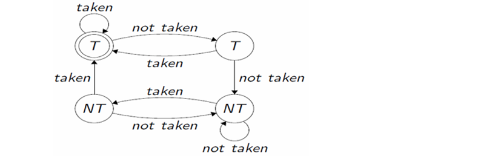
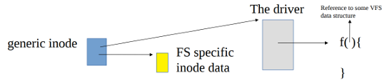

# Appunti di Sistemi Operativi Avanzati, Università di Roma Tor Vergata, anno 2024
*Realizzati da Simone Festa per la preparazione dell'esame scritto, includendo la teoria strettamente legata alle domande fatte negli ultimi anni.*
# Algoritmo di Tomasulo & O.O.O. Pipeline
La pipeline è composta da stage, nei quali transitano le istruzioni. E' efficiente con ridondanza hardware.
La pipeline in O.O.O è replicata, e ci sono multiple ALU. Tuttavia, può capitare che un'istruzione possa passare più cicli macchina in un determinato stage, portando ad un rallentamento delle prestazioni.
L'idea alla base della pipeline O.O.O deriva dall'introduzione del concetto di *sorpasso* in essa. Nella O.O.O, se posso andare avanti, lo faccio, non mi importa che devo aspettare il commit, se posso eseguire qualcosa lo eseguo. Per questo parliamo di `WAIT` e non più di `STALL`. 
Nella `WAIT`, appena ho un risultato (outcome di una “corsia”) lo fornisco a chi lo necessita, non mi serve aspettare che si liberi tutta la corsia. 
Chi impiega meno cicli macchina libera anche più velocemente la pipeline, in una pipeline NON O.O.O. lo stallo impatta tutti. Nel caso in cui ho istruzioni veloci che sorpassano istruzioni lente in cui si decide se eseguire o meno un salto si fanno azioni puramente speculative.

Tuttavia, l'introduzione della O.O.O richiede il rispetto di alcune proprietà, ovvero:
- **RAW**: Dati A $\rightarrow$ B, B non può leggere un dato che A non ha scritto.
- **WAW**: Dati A $\rightarrow$ B, B scrive un dato solo dopo che l'A l'ha scritto.
- **WAR**: Dati A $\rightarrow$ B, B scrive un dato solo dopo che A l'ha letto.

NB: Se $i_2$ supera $i_1$ e questa genera eccezione, $i_2$ può alterare lo stato micro-architetturale. 
Per RAW, la soluzione è realizzata implementando l'attesa.
Per le altre due, viene introdotto l'algoritmo di Tomasulo:
Quando si scrive un dato in pipeline, non lo si fa su un registro, bensì su locazioni diverse (non esposte in ISA), afferenti allo stesso registro *logico*. 
Si parla di **register renaiming**, in cui, dato un ordine (A $\rightarrow$ B), viene associato un TAG alle varie istanze (*registri fisici*) tale che chi viene prima (A) non abbia un tag superiore a chi viene dopo (B). 
Se A scrive su TAG0, B scrive su TAG1, A legge su TAG1. 
Alla fine, l'ultimo registro (che sarebbe un alias) usato è quello che sfrutto per il commit.
Potremmo temere il fatto di aver registri limitati, ma lo sono anche le istruzioni, e quindi non è un problema. Nell'architettura proposta da Tomasulo, abbiamo anche altre componenti:
- **Reservation Station**: ogni istruzione mantiene un metadato associato all'ALU per cui accodarsi, si hanno diverse ALU (adders e multipliers ad esempio). Non c'è il concetto di sorpasso, al massimo può esserci tra ALU diverse.
- **ReOrdered Buffer**: mantiene metadati associati all'ordine di entrata in pipeline (alias registri, commit...)
- **Common Data Bus**: Reservation Station e ReOrdered Buffer sono collegate da questo bus comune.
- **OpQueue**: Mantiene il codice operativo delle istruzioni, e le reindirizza.
- **Register File**: Se committo, l'alias lo metto in questa struttura, esponendo in ISA. Ci metto "cose modificate" da istruzioni andate in commit.

Infine, nel caso di un'istruzione che richieda la scrittura in memoria, si passa prima per la scrittura in uno **Store Buffer** per-core (che non mantiene l'ordine basato sull'ingresso in pipeline, inoltre se non è FIFO si ha **store-store bypass**, ovvero potrei invertire il *visibility order*, cioè come gli altri proessori vedono risorse condivise come RAM) e, solo dopo un tempo aggiuntivo effettuare la scrittura. 
La sua presenza causa **load-store-bypass**, ovvero:
Se due thread girano su diverse CPU, il thread A fa una store di X, e B deve leggere X in un instante successivo, tale dato scritto da A potrebbe rimanere ancora nello *store buffer*, portando B a leggere una versione vecchia del dato. La soluzione di questa "parte" è nei meccanismi di *serializzazione*.

# Meccanismi di Lock, serializzazione e RCU
Sappiamo che lo Store Buffer memorizza le informazioni in modalità FIFO, tuttavia tale ordine non è detto sia quello delle istruzioni entrate in pipeline. L'uso dello Store Buffer è alla base del Total Store Order.
Il problema è dato dal fatto di non rispettare la *consistenza sequenziale* (quindi deve quantomeno rispettare l'ordine imposto dalla singola CPU sulle istruzioni, se si hanno `a1` e poi `b1` l'ordine locale deve essere rispettato), anche se si hanno prestazioni migliori.
La scrittura di programmi che affrontano tali problemi si basano sull'utilizzo di *barriere* o *fence*, le quali serializzano le istruzioni precedenti a `load` e `store`.
Di particolare interesse sono le istruzioni atomiche, come `CMPXCHG`, che realizzano un meccanismo di tipo *Read-Modify-Write*. Diventano serializzanti grazie al prefisso `lock`.
Questi meccanismi serializzanti  vanificano i vantaggi del *Total Store Order*, perchè rallentano l'esecuzione. Si cercano quindi approcci alternativi.

## **Non blocking coordination**
### **Lock free**
In questo caso, **non** si usano i lock, e abbiamo questa implementazione se "*almeno una istanza di chiamata a funzione termina con successo in tempo finito e tutte le istanze di chiamata a funzione terminano in tempo finito*".
Un vantaggio delle *lock free* risiede nell'avere sempre un tempo finito, indipendentemente da successo o fallimento.
Si usa una logica *abort-retry*, ovvero date due istruzioni incompatibili solo una otterrà un successo, l'altra subirà un abort e dovrà ritentare.
La concorrenza esiste solo tra lettura e scrittura, non tra due scritture.
Un esempio di applicazione è data dalla gestione di una Lista, in cui l'inserimento di un nodo intermedio si basa sul collegarsi al successore, e poi tramite costrutto `Compare And Swap` ci si collega al predecessore, e la rimozione richiede di "marcare" il nodo come da eliminare per evitare che possano esserci delle ramificazioni nei collegamenti. Un particolare problema di sicurezza è il *traversing*, ovvero se elimino un nodo e un qualcuno vi puntava, tale riferimento rimane, e magari potrebbe puntare adesso ad informazioni sensibili.

### **Wait free**
Anche in questo caso non si usano i lock, ma la logica è leggermente diversa, in quanto non c'è *abort-retry*, in quanto si produce sempre lavoro utile. Quindi tutte le istanze di chiamata a funzione terminano con successo in tempo finito.
Un contesto di applicazione è il seguente: sia dato un registro atomico con uno scrittore ed *n* reader, inoltre si utilizzano delle istanze del registro atomico su cui effettuare le operazioni. Studi dimostrano che il numero ottimale è $N+2$. Le operazioni di lettura e scrittura sono *atomiche*. Vi è un'unica *variabile di sincronizzazione*, lo scrittore mantiene un riferimento all'ultima istanza scritta, e il numero di lettori afferiti, i quali si registrano, aumentando il contatore.
Quando si aggiorna il riferimento, il numero dei lettori viene settato a 0 per il nuovo riferimento, mentre per la vecchia istanza si memorizzano i lettori attestati sui metadati del registro copia. Quando i lettori terminato le loro operazioni, incrementano un contatore presente nel registro copia.
L'istanza può essere rilasciata se *n° letture iniziate = n° letture completate*.

## **Read-Copy-Update RCU**
Trattasi di una via di mezzo tra lock e Lock/Wait free, in quanto vi è l'uso di lock, ma solo per serializzare le operazioni del lettore.
Essa è usata per strutture più complesse accedute frequentemente con più letture che scritture (*read intenive*).
In questo caso, quando lo scrittore deve deallocare un blocco, la deallocazione non avviene subito, ma passa un tempo definito *grace period* tra la richiesta e l'effettiva rimozione. Ciò si fa per attendere lettori che hanno iniziato una scrittura prima del grace period, non avendola ancora conclusa.
L'uso del lock permette allo scrittore di serializzare l'aggiornamento della struttura, attendere i lettori standing, rilasciare vecchia struttura.
Problematico con thread critici.

### **Come capire quanti sono i lettori standing?**
- Nel caso di CPU *non-preemptable*, il writer schedula un thread kernel su ognuna delle CPU su cui ci sono i lettori. I lettori non lasciano la CPU su richiesta. Nel momento in cui ogni thread dello scrittore viene schedulato sulle CPU, vuol dire che i thread associati alla lettura hanno terminato le loro operazioni.
- Nel caso di CPU *preemptable*, non possiamo far riferimento al meccanismo di prima. Ciò che si fa è usare un `presence-counter` *atomico* associato al concetto di `epoca`.
Si contano i lettori attestati su una certa epoca (versione della struttura dati). Quando lo scrittore aggiorna i riferimenti della struttura dati, aggiorna anche il riferimento del `presence counter` verso una nuova istanza. I vecchi lettori, quando terminano la scrittura, decrementano il counter. Quando si azzera, si può deallocare, poichè è terminato il grace period.

# Problematica Cache Coherence e soluzioni
Essendo la cache *replicata*, un lettore deve poter leggere un dato corrente evitando che cache diverse mantengano versioni diverse dello stesso dato.
E' quindi necessario introdurre delle tecniche atte a gestire questa problematica, in modo di consentire a tutti di vedere lo stesso dato.
E' necessario definire delle proprietà base da rispettare:
- Se avviene la scrittura di `val` su una locazione `X`, e nessuno scrive successivamente, dovrò trovare nella lettura successiva su `X` nuovamente `val`.
- Se ho una scrittura e lettura distanti sufficientemente nel tempo e un processore scrive `val` su una locazione, nella quale successivamente non scriverà nessuno, allora la lettura fatta da un altro processore su quella locazione dovrà fornire `val`. 
- La sequenza di operazioni in cache deve essere riproposta in RAM.

Vengono introdotte due **policy**:
- **write-through-cache**: Una scrittura in cache viene riportata immediatamente in memoria. Tuttavia, date due CPU, potrei avere che una CPU aggiorni il dato in RAM, ma l'altra, non scrivendo (e quindi non visionando la ram), utilizzi solo la cache contenente un vecchio valore.
- **write-back-cache**: La scrittura in RAM avviene con un delay temporale non nullo. Questo può portare problemi nel definire l'ordine delle operazioni, e richiede come correzione la *serializzazione*.

Vediamo invece le **famiglie di protocolli**:
- **update**: quando avviene un aggiornamento, propago l'update a tutte le altre cpu.
- **invalidate**: aggiornare una replica vuol dire invalidare le altre, solo chi aggiorna ha la copia aggiornata.

L'**implementazione** per *monitorare* la coerenza della cache (e quindi aggiornare/invalidare) è:
**Snooping cache**: Sia *update* sia *invalidate*, propago l'aggiornamento contattando un controller collegato alle cache, e sfruttando un bus comune. E' poco scalabile perchè sfrutta il mezzo condiviso.

I **protocolli** effettivamente adottati sono:

- **MSI**: Di tipo *invalidate*, è un automa a tre stati: Modified (dati shared modificati), Shared (esistono più copie valide), Invalidate (linea cache invalida). Quando vado in Modified, mando un segnale di Invalidate. Tuttavia, ripetuti accessi allo stato Modified comportano ripetuti segnali di Invalid per altri. Vorremmo evitare di saturare il bus così. Leggo i dati da memoria (se write-through) oppure da memoria o cache (se write-back).
- **MESI**: Di tipo *invalidate*, introduce lo stato *Exclusive*, quando arrivo in questo stato dico che la copia è esclusivamente mia, e questo mi permette di passare allo stato *Modified* senza inviare segnali *Invalid*. Nel caso di lettura di un dato, uso il bus solo se mi trovo nello stato Invalidate (M,E,S già possiedo il dato per modificarlo o leggerlo). Nel caso di lettura di un dato, uso il bus solo se sono in Invalidate o Shared (per passare ad Exclusive, e poi da lì a Modified).
Anche questo automa ha un problema:
Sto modificando un dato (M), mi arriva una richiesta di lettura, e quindi passo a Shared (S), ma se volessi modificarlo ancora dovrei passare per (E) e poi (M). Quindi, per continuare a scrivere un dato che qualcuno vuole leggere (e che io aggiorno) devo passare per S-E-M.
- **MOESI**: Di tipo *invalidate*, introduce lo stato *Owner*, in cui cado se ho la copia master di un dato, che posso modificare passando per Modified, evitando il ciclo S-E-M.
Quando passo da *Owned* a *Modified*, invio il segnale di *Invalid* a tutti.

Esistono implementazioni concettualmente diverse, come **Directory Based**:
Per ogni blocco di memoria (grande come una linea di cache) mantengo una entry dell'entità Directory sita in RAM, che tramite bitmask mi dice in quale cache il blocco è presente (`presence_bit[i]`) e se c'è un update non propagato (tramite `dirty bit`). 

Permette di lavorare in parallelo.
Vediamo alcuni casi di lavoro:
- voglio *leggere* dalla mia cache ma ho un miss:
  - Se `dirty bit = 0` (nessuno sta lavorando col blocco), allora lo leggo dalla memoria e segno che l'ho caricato in cache (`presence bit = 1`). 
  - Se `dirty bit = 1`, qualcuno ci sta lavorando, quindi devo portare quel dato in RAM (`dirty bit = 0`) e leggerlo, impostando `presence bit = 1`.
- voglio *scrivere* su un blocco della mia cache ma ho un miss:
  - Se il `dirty bit = 0`, devo invalidare tutte le altre cache (`presence_bit = 0`) e mettere `dirty bit = 1`, oltre che il mio `presence bit = 1`. 
  - Se `dirty bit = 1`, individuo il proprietario, setto `presence bit = 0`, lavoro io sul dato e lascio `dirty bit = 1`, poi mando un `ack` al writer.

Oggi si usano **processi hyperthreaded**, in cui flussi di programmi diversi accedono allo stesso *core fisico* (come reservation stations) poichè, a causa del memory wall, non si sfruttano pienamente le "corsie". I registri, i fetch buffer sono replicati. 
Si può introdurre anche il concetto di *false cache sharing*: Se A scrive X su una certa linea di cache, e B scrive Y sulla *stessa* linea di cache, sto creando molteplici transizioni inutili per lo stato *owned* della stessa linea. Ciò avrebbe più senso se ci fosse solo A che scrive X e Y sulla stessa linea, in quanto altrimenti avrei cose scorrelate.

# Branch predictors

Nella pipeline, come affrontiamo/supportiamo i salti? Questi sono di natura differente, abbiamo:
- salti condizionati (`if`, `else`) → due possibili destinazioni.
- salti non condizionati e call  (`jmp 0x2a1`, `call`) → una sola destinazione.
- return e branch indiretti (`ret`, `jmp [register]`) → molteplici destinazioni.

Un supporto fornito dal **branch target buffer**: è una cache in cui ciascuna entry riporta un indirizzo e un target da utilizzare quando il flusso di esecuzione passa per il rispettivo indirizzo. *Come si suggerisce?*

## **Branch Predictor Buffer**
Lavora a *1 bit*, quindi due stati (Salto, Non salto). Per ogni riga aggiungiamo *status bit* che indica se l'ultima predizione è stata rispettata.
Cache indicizzata coi bit meno significativi, sfruttando la località. Poco efficiente con i cicli annidati, sbaglia due volte di fila.

## **Multiple Bit Predictor**
Lavora su *2 bit*, quindi quattro stati. Lavora bene con cicli annidati.

Tuttavia qui si assume "indipendenza" tra i salti (non condivido stesse variabili).

## **Correlated Predictors**
Si hanno `m` predittori a `n` bit. `m` rappresenta il numero di salti precedenti su cui valuto la predizione, mentre `n` sono il numero di errori consecutivi del predittore prima di cambiare previsione. Si ha *Pattern History Table* a $2^m$ entries (ciascuna mantiene lo stato corrente di un automa ad *n* stati) e un *Global History Register* che mantiene le ultime *m* predizioni (con valori 1 o 0 a seconda se il sto è stato fatto o meno) e viene usato come indice per spiazzarsi nella tabella.

## **Tournament (supporto hardware)**
Supporto a predizione locale e globale (associato alla presenza di più elementi e non threads). C'è FSM che indica quale predittore usare.

## **Supporto branch indiretti**
E' una cache con:
- `branch address`: indirizzo con l'istruzione di tipo `jmp ...`
- `prefetched target`: dove mi ha portato il branch target prima, è una predizione.
- `prediction bits`: mi dice se ho indovinato la predizione nelle volte precedenti.

Se si ha cache miss (non ho predizione) lo alleno, magari mettendo l'istruzione subito sotto.

# Cache Side Channel Attack
Un side channel attack (attacco a canale laterale) è una tecnica di hacking che sfrutta informazioni indirette ottenute dal sistema informatico, piuttosto che cercare di superare direttamente le sue difese. In particolare, nel caso degli attacchi inerenti alla cache, ciò che si fa è partire da uno stato noto della cache (es: flushandola), compiere attività speculative che alterano lo stato micro-architetturale, e poi mediante meccanismi quali timer, discriminare cosa è stato mandato in cache mediante un probe array e il conteggio del tempo.
Vediamo quali sono attacchi noti basati su tale meccanismo:

## **Flush + Reload**
Dati due thread A (la vittima) e B (l’attaccante) che hanno la possibilità di accedere alle medesime informazioni in memoria, B può eseguire il *flush* della cache per poi eseguire  degli accessi cronometrati in memoria (*reload*): se per leggere un dato impiega poco tempo, vuol dire che, nel frattempo, quello stesso dato è stato ricaricato in cache da parte di A (e quindi viene usato da A). 
Questo meccanismo può essere applicato anche sulle istruzioni macchina: anch’esse, quando vengono accedute per essere eseguite, vengono caricate in cache. Ciò vuol dire che B può essere in grado di capire 
anche quali sono le attività che A sta svolgendo. Nell’ISA, l’unica operazione esposta per la cache è il FLUSH. Non posso fare altro!
Richiede **timer ad alta risoluzione RDTSC** e **istruzione per flush** `clflush`.

## **Meltdown**
L'obiettivo è ottenere dei dati sensibili (lato kernel) che normalmente non dovrebbero essere acceduti lato user. L'address space prevede infatti user e kernel mode.
Supponiamo di conoscere un indirizzo kernel contenente un certo byte, oltre ad un probe array. Poichè un byte può assumere 256 valori diversi, il nostro probe array avrà 256 entry. Queste devono essere inizializzate, altrimenti non vengono materializzate in RAM. Inoltre, dobbiamo effettuare un flush della cache per portarla in uno stato noto. Realizziamo un'operazione offending, ovvero memorizziamo nel registro `al` il byte contenuto a tale indirizzo kernel. Tutto ciò che avverà dopo sarà speculativo. Proseguiamo facendo uno shift di 12 posizioni sul registro `rax`, infatti `al` mantiene gli 8 bit meno significativi proprio di `rax`. Tale shift è di 4096 byte, che corrisponde ad una pagina di memoria. Se tale shift produce `0`, allora rieseguiamo dall'inizio lo snippet, perchè vuol dire che non abbiamo toccato una zona di interesse. Il fatto di shiftare di una pagina, e di leggere il primo byte di ciascuna pagina, è dato dal fatto che ognuna delle 256 entry sarà associata ad una pagina. Questo perchè leggere un byte comporta portare su una linea di cache (64 byte) e spesso anche le linee adiacenti. Senza questa operazione non saremmo in grado di distinguere i tempi di accesso delle entry. Per concludere, si usa questo byte shiftato di 12 proprio come un indice di array, andando a mettere nel probe array il contenuto della locazione data dalla base del probe array sommato all'indice di pagina appena calcolato, portando quindi il contenuto di tale locazione in cache. Sostanzialmente l'operazione è `mov rbx, byte[rbx+rax]`, e noi stiamo accedendo a `[rbx+rax]`, non so cosa ci sia dentro, ma so che c'è qualcosa perchè il vettore è inizializzato, e copio questo contenuto alla base `rbx` del vettore. Questo mi serve solo per portare l'entry di `rbx+rax` in cache. Per concludere l'attacco, tramite timing, ispezioniamo le entry del probe array, quella che avrà tempo minore sarà quella avente per indice proprio il byte kernel oggetto dell'attacco. E' un attacco probabilistico: `rax` potrebbe essere sporcato durante l'esecuzione, e non sempre le differenze di tempistiche di accesso possono farci capire chiaramente qual è l'offset di interesse.

### **Mitigazioni**
Di seguito, elenchiamo le mitigazioni proposte per Meltdown:
- **Cache Flush**: Quando parte il kernel, flusho la cache. Terribile a livello di prestazioni.
- **KASLR**: Tale approccio risulta valido con processori utilizzanti indirizzi RIP relative, ovvero in casi in cui si utilizzo indirizzi relativi (spiazzamenti) nel codice piuttosto che posizioni fisse. L'idea è randomizzare la page table dell'utente, il kernel viene montato su pagine diverse dell’AS logico. Soffre il brute force.
- **KAISER**: Preludio di IPT, l'idea è scindere in due le aree del kernel accessibili a due *page table* di primo livello diverse, di cui una "essenziale" per lo user, consentendogli di eseguire operazioni come "early system call", e una nascosta all'utente (unmapped), contenente tutto ciò che è valutato non necessario per l'utente. Le altre tabelle non sono replicate. Questo "confine" si può cambiare. Inoltre, aggiornare la vista delle page table comporta il reset del Translation-LookASide-Buffer, generando *page fault* che blocca la speculazione. Questo è alla base della Page Table Isolation. 
- **Page Table Isolation**: Implementazione effettiva, nel registro CR3 viene mantenuto un puntatore alla tabella delle pagine attuale da usare: PML4 user o kernel (ovvero la tabella di primo livello attualmente implementata in Linux). Quella kernel vede tutto, mentre quella user solo area user e parzialmente aree kernel essenziali.
Ogni volta che cambio tabella, flusho il TLB e sperimento un cache miss.

## **Spectre**
Esaminiamo ora la famiglia Spectre, composta da Spectre V1 e V2.

### **Spectre V1**
L'idea non si discosta eccessivamente da Meltdown. Entrambi condividono l'idea di sfruttare la speculatività della pipeline, entrambi usano un probe Array.
La differenza, che rende Spectre più pericoloso, risiede nel fatto che non usa istruzioni generanti trap (come Meltdown) ma si basi sulle miss-prediction del *branch predictor*. Non entro mai in kernel mode.
Supponiamo di avere un indirizzo *qualsiasi*, riferente ad esempio ad un vettore, chiamato `array1`, e un qualsiasi valore `x`. Partiamo sempre dopo aver effettuato il flush della cache. Sia dato un costrutto if, nel quale alleniamo il brench-predictor ad entrare, quindi impostando `x<array1_Size` (non deve essere in cache, altrimenti non azzarda!) in modo da entrare nella condizione `if (x<array1_Size)`. 
La size dell'array non deve essere in cache, altrimenti non ci sarebbe speculazione. Sia dato anche un probe array `array2`.
Successivamente, impostiamo `x>array1_Size` in modo da entrare nell'if solo speculativamente. Accediamo quindi a `y = array2[array1[x]*4096]`, ovvero shiftando sempre di 12 per lavorare su pagine diverse mediante un indirizzo, in modo poi da poter discriminare quale entry del probe array sia entrata in cache. L'idea è quella di *saltare molto lontano* in modo speculativo, partendo appunto da istruzioni che non generano trap.

#### **Mitigazioni per V1**
*NB: PTI non risolve, perchè crea trap da user a kernel, qui noi restiamo user e accediamo a qualcosa di "lontano da noi".*
La mitigazione specifica per V1 consiste nella *sanitizzazione*. Il problema di Spectre V1 nasce dal fatto che pur accedendo speculativamente ad un indirizzo, questo ritorni qualcosa. Normalmente consideriamo un insieme di valori "validi" e "Non validi", i quali dovrebbero essere gestiti. Con la sanitizzazione, restringiamo fortemente il set di valori "non validi" (per poterli accuratamente gestire) e introduciamo un terzo insieme "NULL", in cui cadono tutti i valori non accettabili e che vengono rimandati nel set dei "Non validi". In questo modo, essendo un set ridotto, lo gestisco meglio.

### **Spectre V2**
In questa versione si fa riferimento agli hyperthread e indirect branch. In particolare, hyperthread diversi su stesso core condividono lo stesso predittore. Ciò che avviene è che un hyperthread A può "allenare" il comportamento del branch predictor, che viene usato anche da B. Ciò richiede che almeno questa fase avvenga su stesso core. 
Questo attacco si rivela particolarmente efficace nel momento in cui le istruzioni dei due processi abbiano lo stesso offset dell’address space, e le istruzioni della vittima facciano riferimento a dei gadget, librerie condivise che mappano sugli stessi indirizzi fisici (per vederne il side effect).

#### **Mitigazioni per V2**
Capiamo che il problema appena esposto deriva dal poter influenzare il branch predictor esternamente. Esistono due soluzioni a tale problema, ed entrambe sfruttano **MSR - Model Specific Registers**:
- **Indirect Branch Restricted Speculation**: Restringo la possibilità di speculare, creando un "guscio" in cui il branch predictor non risulta influenzato esternamente. Ad esempio, possiamo differenziare la predizione user da quella kernel, settando a 0 o 1 MSR.
- **Indirect Branch Prediction Barrier**: L'implementazione di Prediction Barrier, ovvero il reset del branch predictor.

### **Mitigazione Retpoline**
La mitigazine retpoline nasce per evitare la speculazione sugli indirect branch, puntando a sostituirli con delle jump, le quali non soffrono miss-prediction.
La realizzazione è la seguente:
Sia dato l'indirizzo a cui saltare, `target`, e lo si metta nello stack. Successivamente, vi è la label della funzione `retpoline`. Ciò vuol dire che sullo stack metteremo l'indirizzo di ritorno associato all'istruzione subito sotto questa label. Ora abbiamo in cima allo stack proprio questo indirizzo, e sotto `target`.
Se la speculazione è corretta, e saltiamo a `retpoline`, si effettua una `lea` di 8 sullo stack, puntando quindi a `target`, e si conclude con `ret`, che effettuerà il return proprio sull'indirizzo puntato dallo stack pointer, cioè `target`. Se la speculazione non è corretta, e si va sotto `call retpoline` abbiamo istruzioni dummy che si concludono con un `jmp` ad inizio codice, ovvero dove c'è `call retpoline`. 

# Paginazione
La paginazione si occupa della gestione della memoria, dividendola in pagine da allocare quando richieste.
Ciò che fa + mappare un indirizzo logico su un indirizzo fisico. Spesso è associata all'uso della segmentazione, la quale consente di avere indirizzi logici continui, a scapito degli indirizzi fisici. Per individuare tali indirizzi logici in memoria si consulta proprio una tabella delle pagine.
Identifichiamo due tipi di pagine:
- **pagine directly mapped**: dato il loro indirizzo logico $V_A$, il corrispettivo indirizzo fisico $P_A$ è in funzione di VA, tipicamente sommando un offset. In ogni caso, $P_A = f(V_A)$.
- **pagine non-directly mapped**: non sussiste il legame $P_A=f(V_A)$, l'unico modo per ottenere VA è consultare una tabella delle pagine (identity page table).

E' possibile classificare la memoria in zone, in particolare:
- **DMA**: per usi specifici
- **Normal**: contenente pagine kernel directly-mapped.
- **High**: contenente pagine kernel sia NON-direcly-mapped sia user.

Esaminiamo l'evoluzione di pari passo col Kernel Linux:

## **x86 Protected mode (32 bit)**
Linux `i386` vede tre livelli di paginazione:
Page General Directory (PDE) $\rightarrow$ Page Middel Directory  $\rightarrow$ Page Table Entries (PTE),
ma ne vengono supportati solo due, allora per compatibilità la PMD viene impostata con 0 bit.

### **Page Table primo livello**
In questo caso, partiamo da indirizzi a 32 bit. Ciò mi serve per arrivare alle entry, ma questa composizione **non è della entry**.
- I 10 bit più significativi rappresentano l'entry dell'unica page table presente (PDE). 
- I 22 bit meno significativi identificato l'offset a partire dall'inizio del frame fisico identificato dall'entry. Ciò vuol dire che una pagina fisica può spiazzarsi di $2^{22}$, ovvero di 4 mega.
Allora anche il prelievo di una piccola informazione comporta il caricamento di pagine di 4 mega.

### **Page Table di secondo livello**
Qui si hanno due page table e sempre indirizzi di 32 bit, usati da:
- Un'unica page table di primo livello PDE, che usa i 10 bit più significativi per identificare l'entry che punta ad una delle tabelle di secondo livello PTE.
- Una delle PTE, che usa altri 10 bit per identificare l'entry associata ad una certa pagina fisica.
- La pagina fisica, che usa gli ultimi 12 bit per spiazzarsi, potendo farlo per $2^{12}$, ovvero 4096 byte. Su tale dimensione si realizza l'allineamento.

### **Strutture delle entries delle Page Tables**
- **PDE 32 bit**: Essendo presente sia in organizzazioni di primo livello sia di secondo livello, mantiene un bit indicante la grandezza delle pagine usate, `page size`, 12 bit di controllo (come viene rappresentata l'entry), ma modalità operativa (`supervisor`) e il bit `accessed` per vedere se il firmware ha consultato la entry. Nulla mi dice se posso fare o meno il fetch di istruzioni nella pagina!
Vi è il bit `present` che, se pari a 1, dice che la entry è valida e ci porta su una pagina fisica perchè esiste un'associazione valida. Proprio questo bit sarà alla base dell'attacco **L1TF**.
- **PTE 32 bit**: Non ci serve la `page size` (PTE mappa sempre su 4096), per il resto condivide la struttura appena descritta.

NB: allo startup del kernel si usa la paginazione ad un livello che mappa solo due pagine di 4MB, il quale indirizzo si trova in CR3. Bisognerà quindi passare alle pagine di 4KB, riorganizzare in diversi livelli le page table ed estendere le dimensioni di memoria riservate al kernel.

### **PAE - Physical Address Extention**
Viene realizzata l'estensione degli indirizzi fisici da 32 bit a 36 bit.
La size delle tabelle delle pagine si riduce (da $1024$ a $512$) perchè per rappresentare 36 bit fisici non posso usare 32 bit logici, bensì ne userò due (per un totale di 64), e i restanti bit vanno in una terza tabella delle pagine.
Viene introdotta la **PDPM** (2 bit), seguita da PDE e PTE (9 bit) e l'offset della pagina (12 bit).

Con quest'ultimo step si passa a **long mode**:

### **Long Addressing, 64 bit**
Si estendono gli indirizzi logici a 64 bit, anche se, per ottimizzazione hardware, se ne usano solo 48. Viene introdotta una nuova tabella di primo livello, **PML4**, seguita da PDPM, PDE e PTE.
Tutte queste tabelle hanno a disposizione 512 entries (9 bit), l'offset resta a 12 bit. PML4 è puntata da CR3.
Il fatto di non avere a disposizione tutti i bit porta all'introduzione della **canonizzazione**. (Dall'alto verso il basso, gli indirizzi crescono). I bit più significativi (sono 17), vengono posti tutti a 1 o tutti a 0. Gli indirizzi di mezzo sono non canonici.

Esaminando le entries delle pagine di tutti i livelli, tutte presentano `present bit` e un'informazione per dire se punta ad una tabella di livello inferiore o meno (`page size bit`).
Ad esempio, la PDPM potrebbe puntare a pagine di 1GB (usabili *solo* dal kernel), mentre la PDE a pagine di 2MB (**Huge Pages**).
Le **Huge Pages** mi permettono di avere pagine fisiche (frame) contigue, quindi mi servono anche meno entries nel TLB. Inoltre, pagine così contigue riducono la probabilità di cadere nella stessa linea di cache, perchè "servendomi insieme" li vado a mettere su linee cache diverse. Lo svantaggio è che le sto togliendo al Kernel!

Di rilevante c'è il **flag XD** (che rivederemo nella parte di sicurezza), il quale evita ad un attaccante di iniettare il codice malevolo.Il concetto di gestione della memoria ben si lega ad un discorso sui principali servizi per allocazione/deallocazione di memoria a livello kernel.

Avendo a disposizione $2^{48}$ indirizzi per il mapping, questa dimensione esosa permette di identificare tutta la memoria RAM sia mediante approccio directly-mapped sia non-directly mapped.
Si ha quindi un doppio mapping. Il concetto di zona rimane, ma perde di significato. Solo memoria logica è contigua.

# Allocazione e deallocazione a livello kernel.

Identifichiamo innanzitutto le seguenti strutture:
- **Identity Kernel Page Table**: tabella "ancestrale" per il kernel, svolge il compito di mappare gli indirizzi logici kernel in pagine fisiche.
- **Core Map**: Mantiene, per ogni nodo NUMA, lo stato dei frame fisici.
- **Free List**: Mantiene, per ogni nodo NUMA, una lista di frame liberi, anche accoppiati. Consulta la Core Map.

La Identity Page Table, durante lo startup del kernel, non è ancora definitiva. Infatti all'inizio ha a disposizione solo due page table, puntate da CR3, di dimensione singola di 4MB. Ciò vuol dire che tale dimensione non è quella definitiva, e quindi dovrà espandersi. Core Map e Free List non sono ancora materializzate allo startup.

Detto ciò, introduciamo il **Buddy Allocator**, avente il ruolo di allocare i frame liberi. Esso lavora in potenze di $2^i$, dove $i$ è l'ordine, e $2^i$ è il numero di frame che ne fanno parte. L'accorpamento avviene con frame liberi, contigui e tali che l'operazione rispetti l'ordine delle taglie successive.
La **Core Map** presenta all'interno delle entry dei puntatori ad altre entry della Core Map stessa, in particolare puntando ai vari ordini di frame identificati dal Buddy Allocator.
Nella **Free List** abbiamo una lista che, all'entry *i*, punta i blocchi concatenati liberi di size *i* di una zona.

Il **Buddy Allocator** è condiviso tra CPU e consultabile con spinlock. Esso fornisce solo memoria fisicamente contigua *directly mapped allineata*. Il Buddy Allocator può anche *splittare* le allocazioni fornite.
Nel caso in cui fosse necessaria della memoria logicamente contigua (ma non in memoria fisica) il Buddy Allocator risulta inutile, e bisogna introdurre un nuovo allocatore ad hoc. Non tutte le versioni del Kernel Linux permettono ciò, in particolare il problema è dato dal ritornare un indirizzo unico per delle pagine non contigue.

Dato il fatto che il Buddy Allocator è condiviso tra CPU, capiamo come possa essere un collo di bottiglia. Proprio per questo viene supportato da delle cache, chiamate *quicklist*, ovvero insieme di pagine cached, associate ad ogni CPU, in modo da non richiedere nè l'uso dei lock nè l'uso della sincronizzazione. *Queste liste vengono usate per l'allocazione e deallocazione di page table ad ogni livello, in quanto operazioni frequenti*. In particolare queste sono memorizzate da un allocatore che ha già preso pagine dal buddy allocator (**Quick allocator**).

Nel momento in cui non ci sia solo il Buddy Allocator, si fa riferimento a delle *mem-policies* che definiscono da chi devono provenire le pagine. Esse sono associate ai Thread Control Block, quindi sono per thread. Esse possono essere:
- per zona: decido su quale nodo materializzarle.
- per thread.

Potrebbe essere necessario allocare meno di una pagina, ad esempio per estendere il TCB. Questo si realizza mediante *SLAB FISICO*, che mantiene dei riferimenti, per ogni taglia, di chucks di pagine cached aventi stessa dimensione. Posso anche creare uno *SLUB VIRTUALE* che può appoggiarsi su quello fisico se già esistente. Trattasi comunque di un layer sotto il buddy system, non è una vera cache. A questi SLAB può essere anche assegnato un colore, e si parla di *SLAB coloring*. Lo SLAB fornisce memoria pre-riservata fornita dal Buddy Allocator, di *tipo directly mapped*. Quando termina, si richiama il B.A.
In particolare, essendo questi chunks ridotti, è possibile avere collisioni sullo stesso offset. Ciò che si fa è quindi identificare un codice (Colore) per ridurre tale probabilità.
Identifichiamo quindi l'offset con $DSIZE + CLR*ALN$, dove:
- *DSIZE* è la size dei metadati,
- *CLR* è il colore, 
- *ALN* è l'allineamento.

Nel caso ci fosse necessità di allocare dimensioni maggiori di una pagina, si usa `vmalloc`, che altro non fa che richiamare più volte il buddy allocator. L'insieme di più chiamate non fornisce un indirizzamento fisico contiguo, ma solo logico. Quando si esegue una `vmalloc` o una `vfree` su un core tutti gli altri core devono visualizzare l’aggiornamento. Dunque i **TLB Translation Lookaside Buffer**, struttura dati che cacha le associazioni <indirizzo logico–indirizzo fisico>, devono essere aggiornati.

## **Attacco L1TF, L1 Terminal Fault**

Prima, parlando del bit `presence` nella PTE, abbiamo anticipato un collegamento con L1TF, che esaminiamo ora.
Il fatto che `presence = 0` non evita che, speculativamente, possa usare gli altri bit per accedere alla memoria e sporcarla.
Se vi accedo, genero un page fault. Alcuni processori presentavo una vulnerabilità per cui, anche nella situazione sopra esposta, usano tale indirizzo come indirizzo fisico per accedere alla cache L1. Se tale indirizzo è presente, possono propagare i dati.
Una mitigazione consiste nel far sì che il kernel setti questre entry a dei valori non validi, in modo che non siano mappabili in cache.
Esiste però un caso in cui questo attacco ha ancora successo: nel contesto delle Virtual Machine.
Qui è importante ricordare che la VM crede di usare indirizzi fisici, anche se "percorre i livelli di paginazione" (partendo da PDE puntata da CR3), arrivando alla PTE, questa non fa altro che puntare a sua volta ai quattro livelli di paginazione del sistema host. L'attacco si compone in questo modo:
Sia data una entry della PTE guest, non valida, che punta ad un indirizzo X senza passare per la Second Level Translation Host, e il cui dato associato si trova attualmente in cache.
Ciò che avviene è che, con `presence = 0`, non si passa assolutamente per la Second Level, bensì si va speculativamente a vedere in L1. Se tale dato è presente, verrà usato come indice per spiazzarsi in un probe array, in modo da estrapolare informazioni. L'importante è che Attaccante e vittima girino sullo stesso core, in modo da condividere la cache.

# Segmentazione/Indirizzamento in Linux
L'idea alla base della segmentazione è la suddivisione dell'addess space in "segmenti logici", identificabili da un identificatore e al cui interno è possibile spiazzarsi con un offset. Ciò permette di avere memoria logica contigua, ma tipicamente non memoria fisica contigua. Per questo la segmentazione si appoggia sulla paginazione, la quale realizza un mapping sui frame fisici.
In particolare, partendo dalla segmentazione, si ottiene un *indirizzo lineare/logico = base segmento + offset*, che viene usato come entry in una page table (paginazione) la quale ci indirizza verso l'indirizzo fisico in memoria fisica.
Per identificare un segmento non si usa un *id*, bensì vi è un *selettore di segmento* che può includere il nome del registro segmento associato.
In `x86` abbiamo sei registri segmento: CS (codice), DS (dati), ES (dati complessi, come stringhe), FS (per-thread-memory), GS(per-cpu-memory), SS(stack). Oggi partono da indirizzo base `0x0`.

## **Supporto Linux per segmentazione**

### **Real mode**
Si hanno $4$ registri a 16 bit contenenti l'ID del segmento, per gli *offset* si hanno registri general purpose a 16 bit.
Non c'è paginazione, quindi l'indirizzo lineare, calcolato come $ID \cdot 16 + \text{offset}$ coincide con l'indirizzo fisico. Non ci sono bit di protezione atti a separare zona user e zona kernel.
La size massima è $2^{20} = 1MB$, ovvero $2^{16}$ segmenti diversi, che moltiplichiamo per $16$.

### **Protected Mode**
Qui c'è paginazione, e viene introdotta una **tabella dei segmenti** contenente gli indirizzi base dei vari segmenti. Ho $6$ registri  a 16 bit, di cui 13 per identificare il registro di segmento, e 3 per i bit di protezione. Gli offset sono memorizzati su registri a 32 bit. L'indirizzo è calcolato come `table[segment].base+offset`.
Size massima è $2^{32} = 4GB$

### **Long mode**
L'unica differenza rispetto a prima risiede nei registri per gli offset, che sono a 64 bit, anche se ne vengono usati solo $48$, allora la size massima è $2^{48}= 256 TB$, ma solo 128 TB sono per l'indirizzamento logico (Address Space) e 64 TB per quello fisico.
Qui i segmenti, tranne FS, GS e TSS, partono tutti da 0, ed è *imposto dall'hardware*.

### **Tabella dei segmenti**
Prima abbiamo accennato a questa struttura. Esistono due tipologie di tabelle dei segmenti:
- **GDT**: globale, una per CPU/hyperthread, contiene almeno gli indirizzi base dei segmenti kernel, può contenere anche quelli user. L'accesso è possibile tramite il registro packed (quindi è logico) *gdtr*, che mantiene l'*indirizzo lineare in cui si trova la tabella* e il *numero di elementi*. Questo comporterebbe molti accessi in memoria per la consultazione, per questo alcune entry della GDT vengono cachate nel processore. Dato un `index` presente nel selettore di segmento, lo si moltiplica per $8$ (dimensione delle entry nella GDT) e si somma l'indirizzo base da cui parte la GDT. Poi dal segmento trovato, si aggiunge l'offset per spiazzarcisi dentro.
- **LDT**: locale, possono essercene svariate, contiene gli indirizzi base dei soli segmenti user.

Un thread in esercizio può puntare a solo due di queste tabelle contemporaneamente (ma in realtà ne esistono di più!).
In assenza di paginazione, la LDT era utile in quanto permetteva di fornire ai thread viste diverse.
Con l'introduzione della paginazione, e il fatto che ora GDT operi con indirizzi logici, è possibile far usare al thread solo la GDT, la quale può modificare le sue entry, essendo supportata dalla Page Table (unica per tutti i thread che appartengono ad un processo, condividendo stesso AS) che mappa in memoria fisica.

### **Aspetti di sicurezza**
Un'applicazione realizzabile solo con segmentazione riguarda la separazione tra segmenti user e kernel.
In particolare, ogni segmento ha associato un proprio livello di protezione `h` (dove 0 è il livello di sicurezza massimo). E' possibile accedere in "routine" aventi livello di protezione minore/uguale, sia nello stesso segmento (**intra-segmento**, il *firmware* vede se il *displacement* cade nel segmento) sia in diversi segmenti (**cross-segmento**, il *firmware* vede se il *displacement* cade nel segmento e se non sto migliorando la protezione). 
E' anche possibile migliorare il proprio livello di sicurezza. Tale possibilità è data dal **cross-segmento via GATE**, ovvero delle porte che permettono di accedere ad un certo livello di sicurezza passando per esse, a patto che sia soddisfatto il livello di sicurezza minima richiesto.
Qui il *firmware* vede se il salto è permesso, guardando il livello di privilegio attuale coi requisiti minimi del gate presente nella IDT, e poi si vede in *GDT* qual è il nuovo livello di privilegio nel segmento CS. **I GATE vengono comunemente usati per interrupt e trap**.

Due dei tre bit di sicurezza discussi prima identificano 4 livelli di protezione, basati su *ring*. Più precisamente, definiscono il **Requestor Privilege Level - RPL**, protezione corrente. E' aggiornabile esplicitamente, basta che non sia "migliore" di *CPL*.
Se parliamo del segmento CS allora l'RPL si chiama invece **CPL (Current Privilege Level)**, aggiornabile mediante *control flow variations* (come dei salti tra segmenti), e non dal programmatore.
Il terzo bit identifica se stiamo usando *GDT* o *LDT*.

### **TSS - Task State Segment**
E' il segmento in cui viene descritto lo stato di un task (ovvero, un thread). Ciò che fa è mantenere uno snapshot della CPU. E' quindi per-cpu e vi accede solo il kernel. Originariamente era stato concepito per permettere uno switch del contesto di esecuzione, anche se il suo reale utilizzo oggi è appunto mantenere lo stato del task corrente. Per evitare che thread diversi cadano nella stessa area, a differenza dei segmenti citati prima, qui la base non è `0x0`. E' identificabile mediante un registro. Oggi è usato per supportare l'organizzazione **RING**. Poichè esistono quattro livelli di protezione, è lecito pensare che debba esserci, per ogni ring, il proprio stack. TSS mantiene proprio gli stack pointer agli stack da 0, 1 e 2, il 3 viene salvato quando si cambia livello. Il cambio avviene con il *context switch*.

### **Problematica del passaggio dei dati con il modello RING**
I registri sono inadatti per mantenere i dati, e non posso usare i pointer, in quanto romperebbero tutta la logica appena creata.
Esponiamo il seguente problema, e vediamo come è stato affrontato nelle varie implementazioni:
Vogliamo usare la syscall `read()` per leggere da un certo canale `x` un qualcosa ad offset `y` presente nel segmento DS user. Usare una syscall vuol dire passare all'esecuzione kernel, quindi questo dato verrà cercato nel DS kernel!

#### **Soluzione in x86 protected Mode**
Siamo in 32 bit, e la base dei segmenti non è forzata a 0.
Qui abbiamo totale separazione tra i segmenti user e kernel. L'idea è mappare il segmento programmabile FS su DS user, in modo che la syscall vada a prelevare l'informazione in FS, spiazzandosi di `y`, prelevando i byte e ricollocando FS , senza mai accedere a DS kernel. Tale approccio è **Segmentation Fixup**.

#### **Soluzione in x86 long Mode**
La soluzione si chiama **“per-thread memory limit**.
Qui non abbiamo separazione tra i segmenti user e kernel, quindi non posso usare la tecnica di prima. Ciò che si fa è individuare un valore `addr_limit` usato come taglio "*verticale*" per separare user e kernel. In particolare, quando si fa un salto ad un certo segmento, si verifica che il pointer e l'area in cui operare non superino tale limite.

Oggi esistono API specifiche.
- E se volessi leggere aree kernel? Secondo i ragionamenti di prima, andrei comunque incontro al check di prima! Esistono syscall "ridondanti" che evitano il check.
- Posso anche "bloccare" la possibilità del kernel di leggere aree *user*, in particolare sfruttando:
  - **SMAP**: blocco accessi a pagine user se il livello CPL è 0, ovvero sono kernel.
  - **SMEP**: blocco il fetch di pagine user se il livello CPL è 0, ovverso sono kernel.
Un altro controllo che si fa è quello sull'area di memoria su cui vorremmo operare (magari non è `mmappata`, comunque dovrei vedere se c'è la dimensione necessaria per l'operazione). Il controllo viene fatto mediante `access_ok()`, ma è costoso, e quindi si fa il check solo su `addr_limit`, demandando il resto a un `masked kernel segmentation fault` nel momento in cui alcune pagine non sono mappate.

# Interrupt hardware e software, Deferred Work, Top-Bottom Half

## **Concetto di Interrupt, Task queue**
Parliamo di Interrupt in un contesto in cui un dispositivo richiede di cambiare il suo stato. Tale operazione deve essere eseguita immediatamente, altrimenti genererebbe una catena di ritardi. Le interrupt sono asincrone. La problematica principale in tale gestione risiede nel fatto che si possono avere svariati segnali di Interrupt, portando quindi in deadlock la gestione multipla. Ciò è alla base del concetto di **Top-Bottom Half**. Si suddivide la gestione dell'interrupt in una parte Top Half, eseguita subito in modo serializzata, la quale organizza dei metadati, manda un *ack* al dispositivo e prepara su una struttura **Task Queue** la funzione e i dati che dovranno essere eseguiti dalla parte Bottom Half, *accodandoli*.
Tipicamente questa esecuzione avviene in un secondo momento, portando al concetto di *Deferred Work*. In particolare ciò è necessario per consentire l'esecuzione del Bottom Half in punti "sicuri" del codice kernel, che prendono il nome di *Safe Places/Punti di riconciliazione*. Abbiamo tre tipi di Safe Places:
- Al ritorno di una syscall kernel.
- Durante un context switch.
- Nel momento in cui viene creato/schedulato un thread apposito per la gestione dell'interrupt (*Process context*).

E' importante che nel codice kernel non siano presenti istruzioni (tipo do while) che impediscano al kernel di raggiungere un safe place.

### **Supporto Linux (parte software)**

Parlando di *Task Queue*, esse sono delle code contenenti i task che devono essere eseguiti in occasioni di determinati eventi. Ne identifichiamo tre tipologie:
- `tq_immediate`: Task eseguiti al ritorno da una syscall, o in base alla cadenza del timer.
- `tq_timer`: Task eseguiti in base alla cadenza del timer.
- `tq_schedule`: Task eseguiti durante Process Context.

Questa struttura presenta dei limiti, i quali sono stati via via limati nelle versioni successive:
- Non abbiamo località in base ai nodi NUMA.
- Non possiamo gestire thread più importanti (es: real time), perchè la sua esecuzione avverrà dopo i bottom half.
- Non sono ammesse attività bloccanti.

Infatti, se c'è uno `schedule()` che lascia il posto di A a B, e nel mentre ci sono da eseguire bottom half (anche bloccanti), B li eseguirà, venendo deschedulato per la loro esecuzione, la quale poi lascerà posto ad un altro thread C, non rispettando quindi le direttive dello scheduler.
Miglioramenti sono introdotti dal Kernel 2.5:

#### SoftIRQ
Qui l'idea è che il Top Half sia ulteriormente ridotto, perchè non devo inserire io cosa fare, come nelle Task Queue tramite accodamento, ma devo solo scegliere cosa fare.
Qui si ha un interrupt che colpisce la Trap Interrupt Table (TIT) o IDT in `x86`, puntata dal registro `idtr`.
Ciò attiva, in modo sincrono, il **Top Half** (unico), il quale ispeziona la **SoftIrqTable**, tabella contenenti i puntatori ai gestori delle funzioni Bottom Half.
Ciò che viene fatto dal Top Half consiste nel flaggare le entry della SoftIrqTable associate all'interrupt ricevuto. *La tabella stessa è organizzta in priorità*, e io cerco la funzione associata alla priorità più alta da eseguire.
Questo vuol dire che i BH sono già noti ed è nota la loro collocazione. Il **softIrq Daemon**, presente in ogni CPU, scansiona la **SoftIrqTable** ed esegue le funzioni/Bottom Half mediante thread asincrono. Le applicazioni critiche posso avere priorità più alta del demone, permettendo l'esecuzione di thread più importanti. E' inoltre possibile settare l'affinità demone-interrupt, migliorando quindi la località, ma non posso chiedere ad un'altra CPU di gestire un mio task. Infine, BH possono essere eseguiti in multi-threading. Sono disponibili dei Bottom Half per accodare task.

#### Tasklet
Sono strutture dati comprese in SoftIrq, in particolare fanno riferimento ai bottom half `HI_softIRQ` (priorità elevata) e `TASKLET_softIRQ` (priorità non elavata). 
Mantengono i task, ovvero le funzioni di gestione da eseguire. La peculiarità è che sono accodabili dai programmatori a *runtime*.
Le tasklet sono per CPU e non è consentita la migrazione (quindi un task su CPU Core X viene eseguito da demone X).

#### WorkQueue
Si pone come alternativa a `tq_timer` e `tasklet`, rimpiazzando le `task queue`. La caratteristica fondamentale è che i Bottom Half sono interrompibili ed è consentita (ma non consigliata) l'inclusione di servizi bloccanti, che comunque vengono gestiti, ma che richiedono più dati per la gestione e potenziali blocchi. Non si hanno vincoli sulla CPU, in quanto il demone "`kworker` *multi-thread*, gira tra le CPU, ed esegue i Bottom Half quando schedulato, quindi *deferred mode*. Un ulteriore problema è che prima alla creazione di una workqueue si associava la creazione, per ogni CPU, dei thread aventi il compito della sua gestione.
Per risolvere questo problema sono state introdotte le **concurrency managed work queues**. Si creano più code, ma non si creano i threads associati alla loro gestione, nel sistema c’è un pool di threads per gestire tutte le code, il numero di threads nel pool è controllato dinamicamente dal kernel.

### Architettura (Hardware) per Interrupt
Gli interrupt vengono anche utilizzati per misurare il passaggio del tempo. 
Ciò risulta essenziale in casi di *time-sharing*.
Anche questa gestione richiede una parte TH e BH, in quanto non è vero che ad ogni tick passato corrisponde un'azione, infatti il thread schedulato potrebbe avere ancora dei tick rimanenti. 
Ciò vuol dire che la parte Top Half si limita a verificare se `remaining_ticks == 0`; se ciò è vero, verrà posto un flag sul TCB del thread corrente (`need_reschedule`), e in deferred mode (quindi asincrono), verrà chiamata la funzione `schedule` non appena si sarà raggiunto un safe place.
Troviamo tre tipi di timer hardware:
- *Time stamp*: conta il tempo in base ai clock della cpu.
- *LAPIC timer*: conta il tempo in base al passaggio dei tick, utile per il time-sharing.
- *High Precision*: lavora a grana più fine del LAPIC, utile per contesti Real Time.

Vediamo, velocemente, come opera il bottom half inerente a **LAPIC**:
- marca la **task queue** degli interrupt come attiva.
- marca i jiffies (tempo passato dall'attivazione della task queue).
- operazioni per il conteggio del tempo.
- Verifica se è necessario richiamare lo schedule, se ciò è vero, verrà posto un flag sul TCB del thread corrente (`need_reschedule`), e in deferred mode, verrà chiamata la funzione `schedule` non appena si sarà raggiunto un safe place.

Oggi, come detto prima, non si utilizzano più le task queue, bensì softIRQ, tasklet, work queue. Esaminiamo l'architettura hardware APIC per la gestione degli interrupt.

#### APIC - Organizzazione hardware per la gestione degli interrupt
La struttura prende il nome di APIC, e presenta, un'istanza locale LAPIC (è un controller) per ogni CPU. Lapic Timer appartiene al LAPIC. 
Vengono messi a disposizione degli pseudo registri per inviare segnali di *Inter Process Interrupt* IPI. 
> Digressione su **IPI**: Terzo tipo di evento oltre alla  **trap** e **interrupt**. E’ un interrupt ricevibile da una CPU ed inoltrabile ad un’altra. IPI è un evento sincrono al mittente e asincrono al ricevente (o più riceventi). Permette di definire un protocollo di tipo *request / reply*, in cui la request non è altro che una richiesta da parte del CPU-core sorgente di effettuare un cambio di stato, mentre la reply è l’esecuzione vera e propria del cambio di stato da parte dei CPU-core destinatari. Vengono generati a livello *firmware* e processati a livello *software*. Gli IPI hanno due livelli di priorità diversi:
**high**: il ricevente processa immediatamente
**low**: porta all’accodamento degli IPI che poi verranno processati nel momento più opportuno 
(in stile top half / bottom half). Il TH è soggetto a schemi di priorità.

In sostanza permettono il *coordinamento della CPU*, richiedendo un cambio di stato gestito in base alle priorità esposte prima.

E' presenta un bus comune, **APIC Bus**, che mette in comunicazione tutti questi LAPIC con **I/O Lapic**, il quale riceve anche interrupt esterne e le ridistribuisce.
Ciò avviene in modalità *fissa*, ad esempio redirizionando tutte le interrupt ad una certa CPU, o in maniera *logica*, ad esempio con round robin. Quest'ultima modalità è utile per chiedere a tutte le CPU di fornire un'informazione come l'id.
Le interrupt sono catalogate in base a codici **IRQ** (associato all'interrupt, su quale linea viene mandata), ma ciò che ricevono le CPU sono dei codici **INT** (come è vista dal sistema operativo), in funzione proprio degli **IRQ**. Tipicamente $INT = IRQ + 32$, in quanto i primi 32 valori sono destinati alle trap.

# Invocazione delle syscall, slow e fast path
Partiamo dalle **SLOW SYSTEM CALL**.
Nell'ambito di una chiamata `syscall`, invocata da livello user, si passa il controllo al kernel. Questo richiede l'accesso a dei privilegi superiori. Il meccanismo per realizzare questa operazione si basa sui GATE. In particolare, tramite la `trap`, identificata dall'istruzione `INT` con identificativo di porta `0x80` si permette l'esecuzione in modalità kernel.
Ricordiamo che esistono tre possibilità per cambiare flusso:
- **Salto intra-segmento**, mediante `call`.
- **Salto cross-segmento**:
 Mediante `long jump`, e richiede anche la consultazione della GDT per verificare che tale salto sia possibile.
- **Salto cross-segmento attraverso i GATE**:
 Sfruttando una `trap (INT)` e porta di accesso.

Detto questo, esaminiamo l'evoluzione della chiamata:
- Trattandosi di un segnale trap/interrupt, sicuramente è necessario accedere in memoria per referenziare l'entry della IDT (identificata dal registro packed `idtr` in memoria, che contiene sia l'indirizzo lineare che la taglia).
- Tale operazione richiama un `dispatcher`, un modulo software avente il compito di identificare la systemcall associata al segnale `trap`. Ciò viene realizzato ispezionando la System Call Table, che mantiene per ogni entry l'indirizzo della syscall identificata da `NR_NAME`.
Essa è visionabile solo dal dispatcher.
- Eseguita la syscall, questa produrrà un valore di ritorno, che viene mantenuto in un registro e che il dispatcher deve consegnare al chiamante. Dispatcher invoca quindi **ReTurn from Interrupt RTI**.

`TRAP (INT) a GATE 0X80 -> DISPATCHER -> syscall table -> chiama la syscall -> RTI`

## Se volessi una nuova system call?
Ho le seguenti alternative:
- **Definisco un nuovo dispatcher**:
 Se la syscall deve avere regole diverse, ma serve entry IDT libera. Riduce l'allineamento tra syscall.
- **Ampliare SystemCall Table**:
 Richiede di modificare il makefile del kernel.
- **Usare entries libere nella SystemCall Table**:
 Miglior approccio.

## Implementazione del dispatcher  
### **Dispatcher Linux 2.4 UNISTD32**
Dato il codice numerico della *systemcall*, verifica che essa non ecceda la size della *systemcall table*. Se lecito, ci si spiazza di `eax`*4 (4 byte è la size delle entries). Potrei sfruttare *miss-prediction* eccedendo la size, dovendo ricorrere alla *sanitizzazione*.
Per il **passaggio dei parametri**:
Nella versione `UNISTD32` è compito del dispatcher predisporre i parametri, e questo avviene nello stack. Il dispatcher prende uno snapshot di registri di CPU e lo memorizza sullo stack di livello di sistema. Anche con 0 parametri si fa uno snapshot della CPU sui registri, e quindi il kernel può osservarvi pure non avendone necessità.
L'implementazione appena descritta non è ottimale in termini di prestazioni. Ciò è dovuto dal fatto che vengono richiesti molti accessi in memoria, in particolare:
- *TIT* per la gestione dei gate.
- Consultazione *GDT* per visionare CS kernel, DS e stack kernel tramite TSS.
- Svariati cicli di clock per l'esecuzione, e la non località in NUMA.

### **Dispatcher Linux 2.4 UNISTD64**
Le problematiche appena esposte portano al concetto di **fast system call** per ridurre gli accessi.
Questa nuova implementazione sfrutta *registri MSR* (Model Specific Registers) per mantenere i segmenti prima descritti. L'idea è quella di mantenere le informazioni nella CPU senza usare GATE.
Solo il salvataggio della stack area richiede accesso in memoria, ma in `x86_64` lo switch della stack area viene fatto solo se necessario.
Si ricorre a `swapgs` per aggiornare il segmento GS, swappando due registri MSR, passando da user a kernel per avere le informazioni sulla CPU per il thread corrente e stack. Anche qui c'è il controllo sul codice della system call, che presenta stesso problema e soluzione.
I supporti sono `sysenter` (32) e `syscall` (64) per entrare, `sysexit` (32) e `sysret` per tornare in *user mode*.
Per il **passaggio dei parametri:**
Nella versione `UNISTD64` è compito del dispatcher predisporre i parametri, e questo avviene nei registri, evitando tanti accessi in memoria e l'utilizzo dei gate. Abbiamo anche retrocompatibilità, qui il dispatcher mette i parametri sullo stack, e viene invocato un `wrapper` che li colloca successivamente sui registri. Può introdurre del rumore per limitare il problema di visibilità dello stack esposto prima.
Importante è il **VDSO -  Virtual Dynamic Shared Object**, zona dell’address space condivisa con il kernel e leggibile dall’user, è randomizzata. E' una libreria condivisa. Creata per chiamare alcune syscall in modo *fast* (quindi senza `0x80`), in questo modo per la loro invocazione non occorre fare switch a modalità kernel, riducendo l'uso dei gate.

### **Dispatcher Linux 4**
Qui non vado ad invocare direttamente il servizio richiesto, bensì un oggetto intermedio (**stub/dispatcher secondo livello**) che poi chiamerà la system call. Innalza la sicurezza, applicando maschera di bit al numero della syscall prima di vederne la compatibilità, implementando quindi la sanitizzazione. Rimane il problema che, se passo 0 argomenti, viene comunque esposto lo snapshot CPU, e quindi nella *SystemCall Table* vengono messi puntatori a funzioni intermedie (**wrapper**) che offuscano lo stack kernel. Posso fare tutto insieme mediante delle MACRO `SYSCALL_DEFINEx`.

### **Dispatcher odierno**
Prima di `swapgs` si ha `SWITCH_TO_KERNEL_CR3` per conseguire la **PTI** switchando le page tables. Ciò è attaccabile tramite *miss-prediction*, facendo in modo da usare il GS user rispetto al GS kernel, potendo leggere informazioni in ambito user mode tramite *side channel attack*. Eventuali contromisure sono:
*- Override degli swapgs*;
*- Usare istruzioni serializzanti*;
*- Sfruttare la SMAP (Supervisor Mode Access Prevention)*, evitando l'accesso a pagine user quando si è kernel.

## **Identificazione thread e Namespace**
Oggi i thread posso avere un **PID virtuale** (valido nel namespace in cui si muove), da affiancare al **PID reale**.
Ogni thread è associabile ad un namespace X, e avrà un *vPID* al suo interno. Se richiedo il *pid del parent*, ottengo il suo *vPID* nel namespace di riferimento.
Esiste un *namespace di default* e da cui è possibile creare un thread definito in un *namespace figlio*, che diventa il suo *namespace corrente*. In questo nuovo namespace, il thread creato avrà `vPID = 1`, il suo parent `vPID = 0`.

### **Visibilità**
Un thread nel namespace X non ha visibilità sui namespace superiori (non posso contattare thread o usare le loro strutture dati). E' un contenitore.

## **Dettagli sul dispatcher e IDT**
Gli handler di trap/interrupt vengono gestiti mediante un dispatcher unico in tutto il sistema. 
Esistono delle sottili differenze tra *trap* e *interrupt* che devono essere gestite.
1. Si ha un **preambolo/handler di primo livello** (machine dependent), che memorizza nella stack area un potenziale *codice di errore* o valore dummy e riporta sullo stack l'*indirizzo della funzione che implementa l'handler di secondo livello*.
2. Il preambolo (machine dependent) evoca un oggetto intermedio, il **dispatcher** (unico per tutto il sistema) che aggiunge lo *snapshot CPU* sullo stack e chiama *l'handler di secondo livello*.
4. L'**handler di secondo livello** (in C) usa tutte queste informazioni per gestire l'evento.

Ciò favorisce la modularità.

# Scheduler Linux

## **Dispatchabilità**
La funzione di scheduling sfrutta un'informazione presente nel TCB del thread per capire se esso è candidabile per andare in CPU (non che ci andrà sicuramente). In particolare, il TCB è dispatchabile se è legato ad una **run queue**, se non lo è si trova allora in una **wait queue**, dove i thread dormono in attesa del risveglio.

### **Passaggio runqueue $\rightarrow$ waitqueue**
Se un thread chiama un servizio bloccante e deve essere deschedulato, si usano i servizi `sleep/wait`, perchè il thread è ancora in *runqueue* ma non dovrebbe essere visto dallo *scheduler logic*. 
L'operazione `sleep/wait` comporta collegare il TCB a qualche *waitqueue*, marcare il thread come *sleep*, invocare lo *scheduler logic* per vedere se può veramente andare in sleep, infatti se un thread viene colpito da un evento deve essere rimarcato come `run`. Comunque prima mi collego alla *waitqueue* e poi mi scollego dalla *runqueue*.

L'esecuzione di tale operazione porta a due esiti:
- Il TCB viene rimosso dalla runqueue prima della selezione del prossimo thread da schedulare.
- Il TCB è ancora in runqueue quando viene selezionato il prossimo thread, quindi è ancora candidabile.

Al termine dello `sleep`, scollego il TCB dalla waitqueue.

### **Passaggio waitqueue $\rightarrow$ runqueue**

- Lo scollegamento dalla *waitqueue* viene fatto dal thread che è pronto a tornare in esecuzione.
- Il collegamento alla *runqueue* viene fatto da un altro thread che esegue codice kernel, come servizi o TH/BH.

### **Allocazione TCB**
- **Prima, kernel 2.6**, l'allocazione della stack area e del TCB era unica, richiedendo due pagine al *Buddy Allocator*. Se aumeto la size del TCB, diminuisce quello dello stack, e le pagine che dà il Buddy Allocator sono in potenze di 2.
- **Dopo, kernel 2.6**, sono stati scollegati stack area e TCB, il quale ha pointer nella stack area, favorendo l'espansione.
- **Oggi**, stack non è più allineato secondo Buddy Allocator, ma si usa 
`vmalloc()`, e si parla di *virtually mapped stack*. Inoltre, le pagine prima e dopo di tale area sono `unmapped`, in modo che, se si supera la size dello stack, si cade in `seg fault` senza sovrascrivere.

## **Introduzione alla base di runqueues e waitqueues**
- Inizialmente la *runqueue* era unica, è un array con un elemento per cpu che puntavano tutti all'idle process, sempre schedulabile.
- Per le *waitqueue* abbiamo le `wake_up` che non sono selettive, mentre `wake_up_process()` lo è troppo. Quindi se devo risvegliare un insieme di thread devo svegliarli tutti e riaddormentare quelli che non mi interessano, portando al **thundering herd effect**.

## **Concetti base degli scheduling**
Analizziamo l'evoluzione degli scheduler Linux. L'obiettivo comune è individuare il thread da schedulare. Alcuni concetti sono rimasti invariati, si pensi all'**epoca**: si assegnano dei tick ai threads, mediante il calcolo di *goodness* ma anche valutando (come vedremo dopo) alcuni indici prestazionali. Un'epoca finisce quando tutti i task presenti sulla runqueue terminano i loro tick, quindi non si considerano i task presenti sulla waitqueue.

## **Perfect Load Sharing, Linux 2.4**

Si ha un'unica runqueue, rappresentata come una lista doppiamente collegata. Quindi un thread può andare potenzialmente in qualsiasi CPU.
Nel momento in cui viene chiamata la funzione `schedule`:
1. In merito al thread deschedulato, ciò che si fa è vedere se tale thread debba o meno rimanere in run queue. Se il thread è interrompibile, e ha ricevuto una segnalazione, rimarrà in run queue.
2. Si ispeziona la runqueue in un tempo lineare $O(N)$ si accede al TCB per vedere l'affinità col processore. Se c'è compatibilità si calcola la goodness, calcolata in base a priorità e indici prestazionali. In particolare, si cerca di favorire threads che usano stesse Page Table o se si è stati gli ultimi ad eseguire in CPU. 
3. Effettuo il context switch.

Svantaggi di questo approccio sono:
- Ricalcolo della goodness ad ogni ricerca. Inoltre, se un thread ha goodness = 0 e l'epoca non è conclusa, non ci sarebbe bisogno di calcolare la goodness, ma comunque viene ricalcolata.
- Essendo unica runqueue, la si ispeziona tramite lock.
- Poco scalabile con più *cpu-core*.

## **Load Balancing, Linux 2.6**
In questa nuova versione, si differenziano per i non-real time la runqueue in **active queue** (per chi ha $tick >0$) ed **expired queue** ($tick = 0$, in cui poi ricalcolo i prossimi tick), risolvendo il problema del riconteggio della goodness. Inoltre, alla conclusione dell'epoca, ciò che si fa è semplicemente scambiare i puntatori alle head di queste due queue.
Identifichiamo 140 livelli di priorità: da 0 a 99 per Real Time (`SCHED_RR` se preemptable o `SCHED_FIFO` se decide lui quando lasciare la CPU), mentre da 100-139 `SCHED-OTHER`. Tale organizzazione in priorità permette una ricerca più veloce del thread da schedulare, in quanto ci si limita all'uso di una bitmask in cui si prende il thread più importante. Ciò permette una ispezione in $O(1)$.
Le active queue sono per-CPU, posso visionare quella degli altri solo se la mia è vuota, evitando l'uso dei lock. Inoltre, un TCB appartiene ad una sola run-queue.
La priorità è basata sul concetto di *carico*, ed è un valore presente nel TCB.
I thread *real-time* hanno priorità statica.
Per i thread *non real-time*, identifichiamo due modi per associare la priorità:
- **Statica**: non cambia durante la vita del thread, in funzione dei tick.
- **Dinamica**: si parte da priorità fissa e può variare a seconda di come si comporta il thread. Se un thread viene deschedulato andando in `wait`, quando ritorna ha un miglioramento di priorità, e ciò accade spesso per thread *interattivi*. Questa genera inversione di priorità, per cui un thread inizialmente meno importante può scalzare uno più importante.

Avendo più core, si applica lo *explicit stack refresh*, perchè può capitare che, data una variabile assegnata ad un valore di tipo *per-cpu-memory*, possiamo avere inconsistenza se passiamo per cpu core diverse. Ciò che si fa è ripopolare le variabili per-cpu.

## **Completely Fair Scheduler, attuale**
Elimina il concetto di Priorità dinamica per i thread non-real time, ma lasciandola per quelli real-time (i quali mantengono tempi di ricerca $O(1)$).
Per i thread non-real time si mantiene una struttura di albero *rosso-nero*, basato sul concetto di VCPU, ovvero il tempo speso in CPU diviso il peso calcolato per il thread. Più il peso cresce, meno tempo di VCPU si ha. Più VCPU è basso, meglio è. Il costo è $O(ln(N))$ e rispecchia bene le priorità dinamiche.
Tale organizzazione permette di trovare sul ramo più a sinistra il thread da schedulare.

# Attacchi basati su buffer overflow e contromisure
Un attacco di tipo Buffer Overflow è legato alla possibilità per un thread di accedere, ed eventualmetne sovrascrivere, aree di memoria non legittime.
Tipicamente questo attacco si basa all'uso di `software debole`, come può essere la chiamata `scanf()`, la quale non controlla la quantità di byte inseriti.
Ciò vuol dire che, nel caso in cui lo spazio predisposto sia minore della quantità immessa, potremmo potenzialmente andare a sovrascrivere dati memorizzati sullo stack.
Normalmente, questo insieme di attacchi prende il nome di `stack exploit`, in cui si sfrutta il software debole per raggiungere la locazione `PC` e sovrascriverla, magari ridirezionando il control flow graph in un'altra area del codice.
E' possibile anche uscire dal control flow graph, magari ridirezionando il flusso di esecuzione verso un codice iniettato dall'attaccante.
Questo è il caso di `stack exploit with payload`.
Una problematica per l'attaccante è dato dal fatto che non sempre è possibile sapere dove viene posizionato il payload, e quindi il PC potrebbe puntare non ad inizio istruzione iniettata bensì ad una locazione intermedia.
Una soluzione è data dall'anteporre `NOP` all'inizio del blocco iniettato, in modo che anche cadendo in mezzo, si debba ancora iniziare l'esecuzione vera e propria. 

## **Mitigazioni**
Entrambi gli attacchi vanno a inserire più dati di quelli messi a disposizione. Due mitigazioni sono:
- **CANARY TAG**:
Trattasi di un'informazione read-only associata ad ogni stack frame e collogata tra il program counter e altre info associate alla funzione in esecuzione. Nel momento in cui si ritorna, si verifica se tale valore risulta modificato, nel caso viene interrotta l'esecuzione. Soluzione non definitiva, in quanto il tag è unico per processo e, lavorando con più thread, è possibile modificare il PC senza alterarlo.
- **XD bit (Long Mode)**:
Posso segnare con tale bit le entry nella PT. Queste risultano quindi non fetchabili (nè tantomeno eseguibili), e quindi non utilizzabili nello stack. Neanche questa è soluzione definitiva, in quanto in contesti come JVM si allocano aree di memoria scrivibili ed eseguibili.

Arrivati a questo punto notiamo come il punto centrale sia legato all'introdurre un qualche blocco di codice. Se questi fossero già inclusi?

## **Return Oriented Programming ROP**
Vado a manomettere *più return address "avvelenati"*, in modo tale che ciascun *return address*, scritto dall’attaccante, trasferisca il controllo a una 
particolare zona di codice che esegua determinate istruzioni prima di invocare una nuova return e saltare così alla zona di codice successiva.
Qui ciò che si fa è sfruttare dei *gadget*, ovvero frazioni di codice ridotti, che eseguono istruzioni utili (`mov` ad esempio) e sono succedute da un `ret`. Gadget individuabili con brute force.
Poichè non viene imposto allineamento, si può avere un'interpretazione totalmente diversa delle istruzioni in base al byte iniziale che si legge.

### **Soluzioni**
- **RAP - Return address protector**: 
Ciò che si fa è, in una prima fase preambolo, memorizzare in un registro (tipicamente `ebx`, non soggetto a buffer overflow) l'indirizzo di salto cifrato, e in un altro registro la chiave di cifratura. Viene anche posizionata una copia dell'indirizzo non cifrato nello stack.
Nelle operazioni in coda, in prossimità del `ret`, si verifica se il valore memorizzato nello stack coincida col valore nel registro decifrato. Se è così, si ritorna correttamente.
Non è una soluzione definitiva, in quanto costosa ed è possibile identificare sia il registro contenente l'address sia la chiave.
- **Shadow Stack**: 
Simile a RAP, ma l'indirizzo viene messo in chiaro su un secondo stack, chiamato *shadow stack*. Essendo comunque uno stack, soffre i buffer overflow, oltre a cicli computazionali aggiuntivi.
- **Branch Predictor**: 
Altra possibilità è quella di usare un predittore per avere una stima di dove il codice salterà.
Questa implementazione è molto costosa, richiede patch per essere implementata, è non è ottimale nel caso in cui arrivino segnalazioni.

## **Digressione Heap**
E' possibile anche attaccare l'heap piuttosto che lo stack. La differenza risiede nel colpire i *function pointer* piuttosto che le *return*.
Eventuali soluzioni a questi attacchi:
- **check sul valore del function pointer**:
Vedo se l'address appartiene a indirizzi legittimi prima di eseguire la call. E' costosa, inoltre in caso multi-thread potrei toccare i FP dopo il check e prima dell'invocazione.
- **sanitizzazione**:
Ciascun buffer all’interno dell’heap viene incapsulato all’interno di una *surrounding area*. Ogni surrounding area contiene un *tag read only* che viene controllato ogni volta che si effettua un accesso al buffer: finché rimane immutato, gli accessi al buffer effettuati finora sono leciti. Richiede molti controlli.

# Organizzazione e boot di Linux
-  **1. Configurazione e installazione**:
Innanzitutto è necessario *configurare* ciò che verrà usato nello startup, in particolare moduli e sottosistemi del Kernel Linux.
Sostanzialmente, si specificano moduli e si compila un'immagine del Kernel, per poi installarli.
Si crea inoltre un RAM disk, un FS montato temporaneamente dal kernel *durante il boot* avente alcuni moduli compilati.
Essi vengono agganciati a runtime al kernel, e solo dopo si smonta questo file system.
Opera su una finestra temporale finita.
- **2. Boot, associato al bootloader**:  
  - **2.1** Il **firmware**, un programma read-only embedded nel *BIOS* (interazione tramite interrupt, come F12), viene eseguito.
  Il suo compito è caricare e lanciare il *bootsector*.
  - **2.2** Il **bootsector** è un settore predeterminato di un dispositivo (eg: *ssd*) mantenente il codice dello startup del sistema. Il primo settore è *Master Boot Record*, contenente codice eseguibile e partition table.
  Oggi si usa *EUFI*, che supporta il *secure boot*, e permette di eseguire codice EFI. Tipicamente, il processore prende le informazioni qui presenti, le carica in memoria, e passa il controllo al *bootloader* (o *EFI-loader*). 
- **3. Startup**
  - **3.3** Il **bootloader** individua la regione fisica dove caricare l'immagine iniziale del kernel del S.O., per poi procedere con il caricamento effettivo. Ovvero carica in memoria l'immagine iniziale del kernel del S.0., essa include il *machine code setup* per effettuare il setup dell'architettura.
  - **3.4** Il **machine code setup** passa il controllo all'immagine iniziale del kernel.
  Non è ancora la versione definitiva (detta anche *steady state*). 
  *NB*:Il processo *idle process* inizia la sua esecuzione.
  Se *Multi-core*, si fa riferimento ad una sola *cpu-master*, le altre aspettano.
- **4. Operazioni steady-state**
  - **4.1** Raggiunto lo steady state, il kernel rimuove gli oggetti di inizializzazione, i quali potrebbero diventare dei gadget. Le pagine da eliminare sono marcate con `init` ed identificate dal sottosistema `bootmem`, usato dal kernel quando non è steady.

## **Altri aspetti da considerare**
Possiamo avere sia randomizzazione logica, sia fisica. Tendenzialmente si usano insieme, perchè se scopro quella fisica rompo tutto.
- Poichè il kernel sfrutta *indirizzi logici*, usa l'*identity page table*, presente nella sua immagine, in fase di startup per la conversione da indirizzo logico a fisico. In questa fase, la tabella non è definitiva. In **x86 protected mode** si ha paginazione ad un livello che mappa solo *due pagine* da 4MB, e il cui indirizzo è in CR3. Poichè è possibile lavorare con 4GB di RAM, di cui 1GB per il Kernel, sarà necessario estendere la quantità di memoria a tale dimensione,
e lavorare con pagine di 4KB (quindi a due livelli). Non si possono usare *core map* e *free list*, ma solo `bootmem` (che poi sarà sostituita da `memblock`che mantiene traccia dei frame liberi per ogni nodo NUMA).  
- ***Solo se* il kernel è randomizzato**, il bootloader utilizza un’altra tabella delle pagine, **Trampoline page table**, per raggiungere l'immagine iniziale del kernel (e la sua identity page table). Altrimenti, conoscerei sia indirizzo fisico sia logico della identity page table.
- La *patch di Meltdown* rompe la randomizzazione. Essa non blocca la CPU quando si tenta di accedere a una pagina del kernel. Invece, restituisce il valore 0, consentendo all'attaccante di leggere solo il primo byte dell'array probe. Tuttavia, se si tenta di accedere a zone del kernel non mappate, la CPU si blocca perché la tabella delle pagine non risponde. Tale differenza è sfruttabile per capire l'indirizzo logico del kernel. La *soluzione* è mappare le pagine kernel non valide in una pagina fisica azzerata, in modo da non avere differenze a livello di tempo misurato.  

# Virtual File System
Può essere in *RAM*, ed è una rappresentazione della struttura e del contenuto del file system parziale o totale (*file system volatile*), o "*On device*", dove non è detto sia aggiornato.
Identifichiamo due parti per quanto riguarda la manipolazione dati:
- **FS-independent**: layer invocabile anche da altri sottosistemi per lavorare con oggetti I/O (file o directory) in modo indipendente dal FS.
- **FS-dependent**: layer invocabile per oggetti I/O *specifici* del FS.
Un oggetto del FS in RAM mantiene un riferimento ad una tabella (**driver**, è la parte independent) che reindirizza a *tutte le possibili operazioni per tale oggetto* (parte dependent).

Ogni dispositivo (anche pipe, socket...) viene visto come un *file*.
Per una operazione particolare (es `read`) viene esposta *un'unica system call* per *tutti i dispositivi*.
Internamente, la *systemcall* invoca *driver diversi* (quindi operazioni diverse) in base al tipo di dispositivo e tipo di input.
In particolare, i *file*, se subiscono un cambio di stato, rifletto la modifica su un componente hardware, come l'hard drive. Qui la gestione richiede:
1. Un **device superblock** per mantenere i *metadati* (es: dove si trova) del file stesso.
2. Una funzione per leggere i blocchi del file e portarli in cache.
3. Una funzione per flushare i blocchi aggiornati nel file stesso.
4. Un insieme di funzioni per *lavorare effettivamente sui dati* (cachati in memoria) e per triggerare l’attivazione delle tre funzioni elencate qui sopra. 

## **Block device driver vs char device driver**
Esistono due tipi di driver, che possono essere inclusi anche nei dispositivi. Sono tabelle di function pointers che puntano all'implementazione effettiva.
- Il **block device driver** risolve i primi tre punti che prevedono di leggere e scrivere blocchi dei file. *Lavora sui blocchi*.
- Il **char device driver** risolve l'ultimo punto, perchè devo prelevare e consegnare caratteri. *Lavora sui singoli byte/caratteri*(usato con le tastiere).

## **File system type in Linux**
Il Kernel mantiene una **funzione di lettura del superblocco** per interpretare i metadati. Quando monto un FS, rappresentato da un superblocco in memoria, ne viene richiesto il montaggio tramite **RAM FS**, che è il primo FS usato per montare tutti gli altri, prima di essere smontato. Il tipo di *File System* è identificato dal *Magic Number*. La funzione di lettura del superblocco consulta proprio questo valore per vedere se è conforme.

## **Inode e Dentry**
- **Inode** = struttura dati del VFS che rappresenta un oggetto di I/O (specificando determinate informazioni come i permessi di accesso). 
- **Dentry** = struttura dati che, tra le varie cose, assegna un nome a uno specifico oggetto di I/O ed è *associata all’inode del medesimo oggetto di I/O*. Questo perchè l'*Inode non ha nome*.
Quindi **Dentry** per i nomi, **Inode** per metadati.

Quindi l'Inode è generico, mantiene dati generici usati dal VFS e campi specifici del VFS. L'Inode punta anche al *driver*.
`ricevo codice "c" -> identifico iNode -> iNode punta a driver specifico -> driver richiama specifica operazione.`

## **Namespaces**
Un punto qualsiasi del FS può essere usato come ancoraggio per montare altri file system, creando albero di File System. In cima c'è **RFS**, che non è visibile agli altri thread, quindi la radice è in realtà subito sotto. Posso far vedere o meno questi VFS a seconda del thread.

## **File descriptor Table**
Struttura dati nel TCB che costruisce relazioni tra *canali I/O* (codici)e *oggetti I/O su cui lavoriamo correntemente*, abilitando una "ricerca veloce".

# Sicurezza
## **Contromisure ad accessi illeggittimi ai DATI**
Gli accessi illeggittimi sono dati da *side channel*, *branch miss-prediction* (Spectre), *speculazione sul path di esecuzione mediante trap* (Meltdown), *speculazione sul TAG-To-value* (L1TF) oltre che ad hacking delle strutture kernel.

Le contromisure sono:
- **randomizzazione**: utile per accessi in lettura.
- **signature inspection**: controllo la presenza di firme che possono far cambiare il modo operativo del processore.
- **cifratura dei dati**: applicabile a blocchi di dispositivo, pagine, locazioni.

## **User ID in Linux**
Lo user è identificato da *UserID* e *GroupID*.
Ciascun thread, in ogni istante, è associato a tre UID/GID:
- `real`: utente per conto del quale il thread fa le attività.
- `effective`: utente di cui il thread ha le capabilities correnti (sarebbe il tipo di utente attuale).
- `saved`: memorizzazione del vecchio *effective*.

`sudo` imposta il `real` a ROOT, `su` imposta il `real` a un certo utente.

Queste targhe discriminano le capabilities, alla base dei domini di protezione. Identificano cosa un thread può fare o meno. Sono utili perchè non si ragiona solo in "root o non-root", ma posso stabilire i comportamenti a grana più fine.

## **Sistemi operativi sicuri**
Si realizzano mediante:
- **Domini di protezione**: tuple <risorsa, modalità di accesso>. Tipicamente si cerca di fornire sempre il minimo livello di privilegio possibile. Può essere associato agli utenti ma anche ai processi.
- **Security Policy**: E' possibile acquisire *capabilities* dinamicamente. Bisogna quindi regolamentare la gestione dei domini, i quali possono essere:
 *- Discretionary*: gli utenti ordinari (anche il root) possono definire i protection domain.
 *- Mandatory*: la definizione dei protection domain è demandata esclusivamente a un *amministratore 
     esterno* (non il root, quindi). Non si può fare privilege escalation. E' la tipologia richiesta per un sistema operativo sicuro.

Un esempio di Sistema operativo sicuro è il modulo **SELinux**, in cui un security administrator esterno lavora sulla composizione dei domini.
Un software kernel che sincronizza le ACL con un sistema esterno potrebbe essere eliminato solo introducendo un modulo, ma per farlo il thread dovrebbe averne la possibilità, e se questa non è compresa nella ACL, può fare ben poco. Per migliorare ancora, potrei compilare le ACL allo startup.

## **Reference Monitor**
Rinforza i domini di protezione, opera a livello kernel, supervisionando le syscall. Queste passano per il reference monitor, che consulta un *Access Control Database ACD* per vedere se l'utente/programma chiamante può compiere una determinata azione. ACD deve essere configurato dall'amministratore di sistema, e non può essere toccata. 

